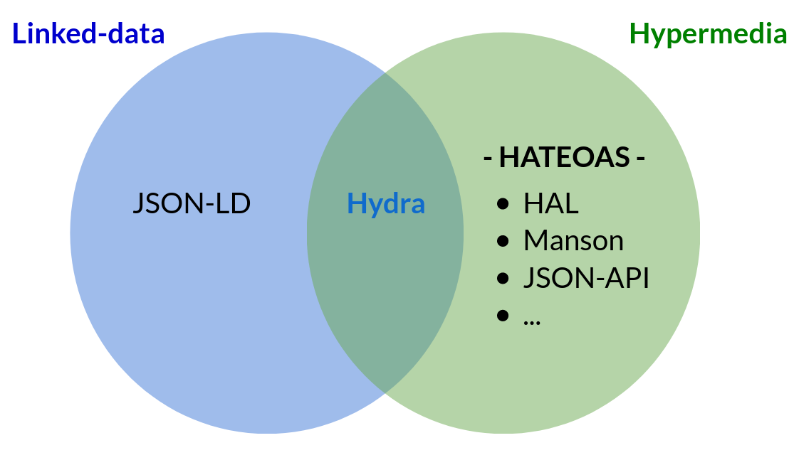

+++
title="OpenAPI dans la jungle du REST"
slug="openapi-dans-la-jungle-du-rest"
marmelab="https://marmelab.com/blog/2020/03/26/openapi-dans-la-jungle-du-rest.html"
date = 2020-03-26
description="HATEOAS, JSON-LD, JSON API, HAL, Hydra ... La liste des acronymes de spécification liées au REST est longue. Quelle est la place d'OpenAPI dans cette liste ?"
tags = ["rest"]
+++

Depuis quelque temps, j'avoue avoir suivi de loin le monde merveilleux des spécifications liées au REST : HATEOAS, JSON-LD, JSON API, HAL, OpenAPI et autres Hydra. Si ces initiatives semblaient donner des réponses intéressantes à des problématiques induites par le flou du style d'architecture REST, le [GraphQL](https://marmelab.com/blog/2017/09/03/dive-into-graphql.html) semblait aussi y donner des bonnes réponses sous un standard unique !

Pourtant ce n'est pas si courant de pouvoir mettre en place des APIs en GraphQL, et force est de constater que nos clients nous demandent le plus souvent de le faire en REST. C'est ce qui s'est passé sur l'un de nos projets client pour lequel nous avons développé plusieurs services métiers (des *macro-micro-services*) communiquant avec l'ensemble de l'architecture via des APIs REST.

Un jour, ce client nous a demandé de mettre en place **OpenAPI** sur l'ensemble de ces services. Soit ! Mais qu'est-ce que c'est concrètement OpenAPI ? Et qu'est ce qui le caractérise au sein de la jungle des acronymes des spécifications liées au REST ?

## La base : le REST

Je me permets une courte digression pour bien poser les problématiques liées au REST. Lisons wikipedia :

> REST (representational state transfer) est un style d'architecture logicielle définissant un ensemble de contraintes à utiliser pour créer des services web. Les services web conformes au style d'architecture REST, aussi appelés services web RESTful, établissent une interopérabilité entre les ordinateurs sur Internet. Les services web REST permettent aux systèmes effectuant des requêtes de manipuler des ressources web via leurs représentations textuelles à travers un ensemble d'opérations uniformes et prédéfinies sans état.

On peut reformuler cela en partie en affirmant que REST utilise :

- l’URI comme identifiant des ressources,
- les verbes HTTP comme identifiant des opérations (GET, POST, PUT, PATCH, DELETE),
- les réponses HTTP comme représentation des ressources.

Par contre, rien n'est dit sur le mode de représentation des ressources (json, html, csv, xml ...), ni sur le contenu de ces ressources (la valeur sémantique du contenu), ni sur les relations des ressources entre elles.

Réglons tous d'abord la question du mode de représentation des ressources, en décidant que nous parlerons uniquement d'une représentation au format json. Il reste à trouver un standard pour normaliser les questions que REST laisse en suspens.  

## La valeur sémantique du contenu : JSON-LD

Si l'uri d'un document peut laisser présager le contenu qui sera retourné, il n'est pas toujours facile de comprendre en détail la structuration de ce contenu.

Prenons l'exemple d'une API renvoyant des informations sur des joueurs.euses d'une équipe de [Roller Derby](https://fr.wikipedia.org/wiki/Roller_derby). Pour obtenir des informations sur un.e joueur.euse, on va faire un appel HTTP en `GET` sur l'uri `https://rdc.io/api/players/playerId` pour obtenir :

```json
{
  "id": "valquirit",
  "name": "Valquirit",
  "number": 75,
  "picture": "http://rdc.io/pictures/RDC_B_75-Valquirit.jpg",
}
```

Ici, si le retour est très simple, il n'est pas forcement très clair. On ne sait pas ce qu'est ce `number`, et on s'interroge sur le `name` valquirit !

C'est ici qu'intervient le [JSON-LD](https://json-ld.org/) : il s'agit d'une méthode permettant d'encoder des données structurées dans un fichier json afin de lui donner un contexte dans l'objectif de donner du sens.

Voyons ce que ça donne sur notre exemple. Et pour commencer, allons faire un tour sur [schema.org](https://schema.org).

Ce projet a pour mission de créer, de maintenir et de promouvoir des schémas de données structurées sur Internet. On va justement y trouver un schéma pour [une équipe de sport (SportsTeam)](https://schema.org/SportsTeam), une équipe étant composée [d'athlètes (athlete)](https://schema.org/athlete), un athlète étant dérivés d'un type plus générique : [une personne (Person)](https://schema.org/Person).

Voilà comment ce contexte serait implémenté en JSON-LD en rajoutant et transformant un petit peu notre exemple précédent :

```json
{
  "@context": "http://schema.org",
  "@type": "athlete",
  "identifier": "valquirit",
  "additionalName": "Valquirit",
  "number": 75,
  "image": "http://rdc.io/pictures/RDC_B_75-Valquirit.jpg",
}
```

Cet exemple est simpliste, mais ce sujet passionnant demanderait de s'y plonger plus sérieusement. En fait, il nécessiterait au minimum un post de blog à part entière. Par exemple, il est notable que le JSON-LD intéresse des projets aux objectifs aussi opposés que [les données structurées prônées par Google](https://developers.google.com/search/docs/guides/prototype) et le [projet de décentralisation du web, SOLID](https://solidproject.org/), de [Tim Berners-Lee](https://en.wikipedia.org/wiki/Tim_Berners-Lee).

**Retenons que le JSON-LD est une spécification visant à ajouter à une document json existant des informations de contexte afin d'améliorer sa valeur sémantique. Et que c'est un des rares [standards](https://www.w3.org/2018/json-ld-wg/) existant dans la série d'acronymes que nous allons aborder dans cet article.**

## Renseigner les relations entres les ressources : HATEOAS

Une autre chose que n'adresse pas l'architecture REST, c'est les relations entre les différents documents. En reprenant notre exemple de match de Roller derby, comment peut-on savoir sans erreur l'uri de la représentation de chaque équipe ? Ou si l'on demande une liste d'équipes et que cette liste est paginée, comment accède-t-on à la page 2 ? Combien y a-t-il de pages en tout ?

Plus généralement, n'y aurait-il pas un moyen de permettre à un système automatisé de parcourir l'intégralité des contenus servis par notre API grâce à une système bien connu: l'[hypertexte](https://fr.wikipedia.org/wiki/Hypertexte) ?

Nombreux sont ceux s'étant posé cette question et il existe une contrainte d'architecture permettant de regrouper toutes ces tentatives de spécification d'un tel format : [HATEOAS](https://fr.wikipedia.org/wiki/HATEOAS), abréviation d'Hypermedia As The Engine of Application State (Hypermédia en tant que moteur de l'état d'application). Et c'est dans cette catégorie que l'on va trouver le plus d'acronymes :

- [UBER](https://rawgit.com/uber-hypermedia/specification/master/uber-hypermedia.html),
- [HAL](http://stateless.co/hal_specification.html),
- [Mason](https://github.com/JornWildt/Mason),
- [JSON-API](https://jsonapi.org/),
- ...

Cette profusion s'explique en partie par le fait qu'une telle spécification implique une vraie restructuration des documents json retournés par une API (contrairement au JSON-LD). Par exemple, voici ce que pourrait donner notre API de Roller Derby en utilisant le format **JSON-API** sur une liste de joueurs.euses (sur une requête en `GET` sur `https://rdc.io/api/players?pagination=[2-2]`):

```json
{
  "meta": {
    "totalPages": 9
  },
  "data": [
    {
      "type": "player",
      "id": "rice-cooker",
      "attributes": {
        "number": 187,
    	"picture": "http://rdc.io/pictures/RDC_B_187-Rice-Cooker-.jpg",
    	"name": "Rice Cooker"
      }
    },
    {
      "type": "player",
      "id": "claraclette",
      "attributes": {
	"number": 171,
    	"picture": "http://rdc.io/pictures/RDC_B_171-Claraclette.jpg",
    	"name": "Claraclette"
      }
    }
  ],
  "links": {
    "self": "https://api.domain/players?pagination[2-2]",
    "first": "https://api.domain/players?pagination[1-2]",
    "prev": "https://api.domain/players?pagination[1-2]",
    "next": "https://api.domain/players?pagination[4-2]",
    "last": "https://api.domain/players?pagination[9-2]"
  }
}
```

## Quelle est la place d'OpenAPI dans tout cela ?

En résumant ce que l'on vient de voir, on peut regrouper une bonne partie des spécifications liées aux API.s REST en deux grandes catégories : celle donnant du sens aux données (Linked-data) et celle reliant les données entre elles (Hypermedia)



*Note: une spécification couvre les deux problématiques : la spécification [Hydra](https://www.hydra-cg.com/).*

**Et donc, dans laquelle de ces catégories peut-on classer OpenAPI ?**

**Eh bien aucune !**

OpenAPI n'a strictement rien à voir avec les documents retournées par une API. Il s'agit d'une spécification pour **documenter** une API sous la forme d'un fichier (en `.json` ou en `.yaml`). Ce fichier va permettre de décrire, produire, consommer et visualiser un service Web REST.

> Un fichier suivant la spécification OpenAPI sera complètement indépendant des documents servis par l'API mais va constituer le **contrat** fourni par cette API.

Mais que peut-on faire d'un tel contrat ? C'est ce que nous verrons dans la seconde partie de ce post : **"OpenAPI : un contrat pour vos API.s"**.
