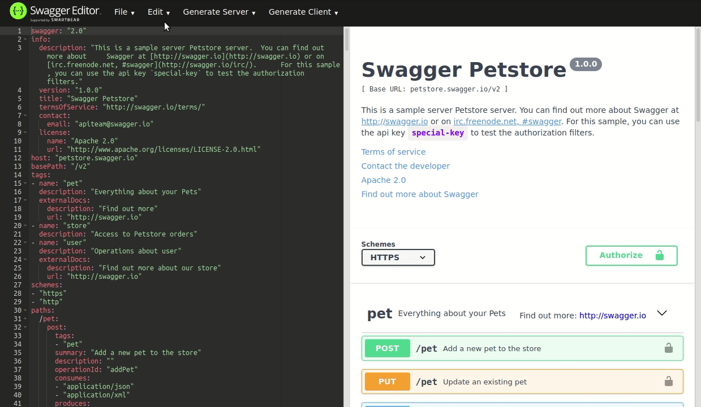

+++
title="OpenAPI : un contrat pour vos API.s"
slug="openapi-un-contrat-pour-vos-apis"
date = 2020-04-17
description="La spécification OpenAPI permet d'écrire le contrat du service fourni par une API REST. Mais comment écrire un tel contrat et à quoi va-t-il servir ?"
draft = false
in_search_index = true
[taxonomies]
categories = ["informatique"]
tags = ["api"]
[extra]
marmelab="https://marmelab.com/blog/2020/04/17/openapi-un-contrat-pour-vos-apis.html"
+++

Comme nous l'avons vu dans le post précédent ["OpenAPI dans la jungle du REST"](/blog/2020/03/26/openapi-dans-la-jungle-du-rest.html), OpenAPI n'impose en rien la structure des documents retournés par une API Rest, au contraire d'autres spécifications comme le [JSON-LD](https://json-ld.org/) ou [JSON API](https://jsonapi.org/).

Au lieu de cela, OpenAPI offre un formalisme permettant de **décrire** la structure des documents retournés et plus globalement les requêtes et les réponses http de votre API. 

Il s'agit d'une spécification permettant d'écrire le contrat (en `.json` ou en `.yaml`) d'un service Web REST.

## De quoi est constitué un contrat OpenAPI

Qu'est-ce qu'un contrat pour une API ? Que contient-il ?

Selon OpenAPI, ce contrat devra fournir :

* des informations générales (`info`) sur l'API (version, mainteneur, ...),
* des informations sur les serveurs (`servers`) depuis lesquels l'API est disponible (serveurs d'intégration, de production ...),
* une description des points d'entrée (`paths`) de l'API et du format de ce qu'ils retournent,
* une description des objets (`components`) possiblement acceptés et/ou retournés par l'API,
* des informations sur la sécurité (`security`), comme l'authentification.

Voici la base de ce que pourrait être le contrat de l'API de Roller Derby abordée dans le [post précédent](https://marmelab.com/blog/2020/03/26/openapi-dans-la-jungle-du-rest.html#la-valeur-s%C3%A9mantique-du-contenu--json-ld) :

```yaml
openapi: 3.0.2
info:
  version: 1.0.0
  title: The famous Roller Derby API
  contact:
    email: contact@alexisjanvier.dev
security: []
servers: []
tags:
  - name: my tag
paths: {}
components:
  securitySchemes: {}
  schemas: {}
  parameters: {}
```

La [spécification](https://spec.openapis.org/oas/v3.0.2) étant bien écrite mais très fournie, je ne vais aborder que les points qui me semblent significatifs pour bien comprendre l'objectif d'un tel contrat.

### `info` : informations Générales

C'est un peu le [readme](https://www.makeareadme.com/) de votre API.

```yaml
info:
    version: 1.0.0
    title: The Famous Roller Derby API - FRDA
    description: >-
    	  Trouver toutes les informations sur les équipes
        et les matchs de Roller Derby en Europe.
        
    termsOfService: https://rdc.io/api/terms/
    contact:
        name: FRDA Support
        url: https://rdc.io/api/support
        email: api@rdc.io
    license:
        name: GNU GPLv3
        url: https://rdc.io/api/LICENSE

```

### `components` : schémas des objets

Le contrat va permettre de décrire les objets acceptés par l'API (paramètres de requêtes, contenu du `body` pour les requêtes de type `POST` ou `PUT` ...) ou retournés dans les documents. OpenAPI utilise un vocabulaire proche de [JSON Schema](https://json-schema.org/) pour décrire assez précisément la validité de ces objets.

```yaml
components:
  securitySchemes: {}
  schemas: {
    Player:
      description: "Un.e joueur.euse de Roller Derby"
      type: object
      properties:
        id:
          type: string
          readOnly: true
        name:
          type: string
          minLength: 3
          maxLength: 50
        number:
          type: integer
          maximum: 9999
          format: int32
        picture:
          type: string
          nullable: true
      required:
        - id
        - name
        - number
        - picture
  }
  parameters: {}

```

### `paths`: description des points d'entrée

Le contrat doit décrire toutes les URI disponibles, le.s verbe.s HTTP utilisable.s sur cette URI ainsi que les réponses potentiellement retournées avec un verbe spécifique pour une URI spécifique (réponse 200, 404, 500 ...). OpenAPI permet aussi de décrire chaque paramètre obligatoire ou optionnel et de donner des descriptions et des exemples aussi bien sur les paramètres de requête que sur les réponses.

Voici un exemple pour la requête en `GET` sur `https://rdc.io/api/players?pagination` permettant d'obtenir une liste de joueurs.euses.

```yaml
tags:
  - name: Players
paths: {
  players:
    get:
      description: >-
        ### Retourne la liste des tous.tes les joureurs.euses.

        - Cette liste est filtrable et triable.
        - Un exemple de liste en ligne : [Les pétroleuses](http://roller-derby-caen.fr/les-petroleuses/)
      operationId: getPlayerList
      tags:
        - Players
      parameters:
        - name: filter
          in: query
          description: Filters to apply to query. It's a stringified json object, with key/value filter separated by comma
          required: false
          explode: true
          schema:
            type: string
          example: '{"number":75,"name":"Vit Ô Bar"}'
        - name: sort
          in: query
          description: Sort to apply to query. A stringified array with [sortProp, sortDirection]
          required: false
          explode: true
          schema:
            type: string
          example: '["id","ASC"]'
        - name: pagination
          in: query
          description: Pagination parameters. A stringified array with [perPage, currentPage]
          required: false
          explode: true
          schema:
            type: string
          example: "[10,3]"
      responses:
        "200":
          description: Une liste de joueurs.euses.
          content:
            application/json:
              schema:
                type: array
                items:
                  $ref: "#components/schemas/Player"
              examples:
                shortList:
                  summary: Une courte liste de trois joueuses
                  value: >-
                    [
                      {
                        "number": 187,
                        "picture": "http://rdc.io/pictures/RDC_B_187-Rice-Cooker-.jpg",
                        "id": "rice-cooker",
                        "name": "Rice Cooker",
                        "more": [
                          {
                            "question": "Pourquoi ce nom ?",
                            "response": "J’suis pas contre l’idée d’avoir tort"
                          }
                        ]
                      },
                      {
                        "number": 171,
                        "picture": "http://rdc.io/pictures/RDC_B_171-Claraclette.jpg",
                        "id": "claraclette",
                        "name": "Claraclette",
                        "more": [
                          {
                            "question": "Pourquoi ce nom ?",
                            "response": "J’suis pas contre l’idée d’avoir tort"
                          }
                        ]
                      },
                      {
                        "number": 75,
                        "picture": "http://rdc.io/pictures/RDC_B_75-Valquirit.jpg",
                        "id": "valquirit",
                        "name": "Valquirit",
                        "more": [
                          {
                            "question": "Pourquoi ce nom ?",
                            "response": "J’suis pas contre l’idée d’avoir tort"
                          }
                        ]
                      }
                    ]
}
```

Nous n'avons vu ici que les principaux points que l'on devra renseigner dans un contrat, avec un unique objet retourné (un `player` simpliste) et uniquement sur la première route d'un simple `CRUD`, avec uniquement une description d'une réponse *positive* (200).

**On constate que la spécification OpenAPI va permettre d'établir un contrat très précis, mais très, très long à écrire !**

## Les aides à la rédaction

Logiquement, OpenAPI ne s'adressant finalement qu'à des développeurs, il existe beaucoup d'outils facilitant l'écriture du contrat.

Et tout d'abord, dans la spécification elle-même, comme l'utilisation du `$ref` permettant de faire des [références](https://spec.openapis.org/oas/v3.0.2#relative-references-in-urls) au sein du contrat lui-même :

```yaml
Player:
  get:
    description: Informations sur un.e joueur.euse.
    operationId: getPlayer
    tags:
      - Players
    parameters:
      - name: playerId
        $ref: "#/component/parameters/PlayerId"
    responses:
      "200":
        description: Le.a joueur.euse demandé.e.
        content:
          application/json:
            schema:
              $ref: "#/component/schemas/Player"
```

Ou bien encore l'utilisation des mots clés `allOf`, `oneOf` ou `anyOf` permettant la [composition](https://spec.openapis.org/oas/v3.0.2#composition-and-inheritance-polymorphism) d'objet :

```yaml
Player:
  get:
    operationId: getPlayer
    parameters:
      - name: playerId
        $ref: "#/component/parameters/PlayerId"
    responses:
      "200":
        description: Le.a joueur.euse demandé.e.
        content:
          application/json:
            schema:
              allOf:
              	$ref: "#/component/schemas/Person"
                $ref: "#/component/schemas/Player"
```

Ensuite, il existe des [linters](https://fr.wikipedia.org/wiki/Lint_(logiciel)) (par exemple [ESLint](https://eslint.org/) et [Prettier](https://prettier.io/) prennent en charge le `yaml` et le `json`) et même des plugins spécifique pour les linters (comme [eslint-plugin-swagger](https://github.com/gregswindle/eslint-plugin-swagger)).

Si cela ne suffit pas, on peut utiliser des plugins dans son IDE (par exemple pour [Atom](https://atom.io/packages/linter-swagger) ou [VSCode](https://marketplace.visualstudio.com/items?itemName=42Crunch.vscode-openapi)), voir un éditeur dédié comme [Swagger editor](https://swagger.io/tools/swagger-editor/) ou [StopLight Studio](https://stoplight.io/studio/).


Et lorsque le contrat est rédigé, vous pourrez le tester avec un validateur, comme [swagger-cli](https://apitools.dev/swagger-cli/), [Speccy](https://speccy.io/) ou [Spectral](https://stoplight.io/open-source/spectral/).

Il existe même des outils permettant de tester la sécurité offerte par votre contrat, comme [API Contract Security Audit](https://apisecurity.io/tools/audit/)

## Code First : générer un contrat d'API depuis le code

Les outils qui viennent d'être abordés vont permettre de faciliter l'écriture d'un contrat d'API en partant d'une *page blanche*.

Mais il existe une autre approche consistant à générer le contrat d'API depuis le code existant. C'est donc une approche qu'on qualifie souvent de *"code first"*.

Ces outils ne sont pas magiques, ils ne vont pas lire le code pour écrire un contrat. Ils s'appuient le plus souvent sur des commentaires spécifiques à ajouter au moment de l'écriture du code, commentaires qui serviront ensuite à générer le contrat d'API.

On peut citer un projet comme [oas](https://openap.is/) qui se veut indépendant du language de programmation utilisé, ou encore le projet [tsoa](https://github.com/lukeautry/tsoa) spécifiquement conçu pour des serveurs d'API codés en TypeScript et executés sur Node.

Voici un petit exemple de ce que pourraient être les commentaires en `oas` sur une des routes de l'API de Roller Derby : 

```javascript
/* @oas [get] /players}
 * description: "Retourne la liste des tous.tes les joureurs.euses."
 * parameters:
 * - (query) filter {String} Les filtres à appliquer. C'est un objet json transmis en "string"
 * - (query) sort {String} Le tri à appliquer. C'est un objet json transmis en "string"
 * - (query) pagination {String} Le pagination à appliquer. C'est un objet json transmis en "string"
 * responses:
 *   "200":
 *     description: "Une liste de joueurs.euses."
 *        content:
 *           application/json:
 *             schema:
 *               type: array
 *               items:
 *                 schema:
 *                   type: object
 *                   properties:
 *                     id:
 *                       type: string
 *                       readOnly: true
 *                     name:
 *                       type: string
 *                       minLength: 3
 *                       maxLength: 50
 *                     number:
 *                       type: integer
 *                       maximum: 9999
 *                       format: int32
 *                     picture:
 *                       type: string
 *                       nullable: true
 *                   required:
 *                    - id
 *                    - name
 *                    - number
 *                    - picture
 */

routes.get('/players', getPlayerPaginatedList);
```

Mais l'un des projets le plus aboutis et le plus connus reste certainement [API Platform](https://api-platform.com/), reposant sur Symfony et réalisé par la fine équipe des [Tilleuls](https://les-tilleuls.coop/en). Api Platform va bien au delà de l'unique contrat OpenAPI, mais offre un concentré de bonnes pratiques et de bons outils permettant de mettre en place une API.


## Que peut-on faire avec un contrat OpenAPI ?

Vous venez de passer un temps non négligeable à rédiger votre contrat, il passe les validateurs : bon boulôt :+1:. Mais à quoi va servir tout ce travail ?

### Générer de la documentation

C'est l'utilisation la plus classique et la plus connue. D'ailleur, à l'origine, la spécification OpenAPI s'appellait [Swagger](https://swagger.io/). Et si vous ne deviez tester qu'un générateur de documentation pour votre contrat, ce serait sans aucun doute celui-là : [Swagger UI](https://swagger.io/tools/swagger-ui/).


Je ne suis pas loin de penser que rien que pour la qualité et l'utilité de la documentation générée par Swagger, cela justifie l'investissement en temps dans l'établissement d'une contrat OpenAPI. Pour vous en convaincre, vous pouvez aller jouer avec leur [demo](https://petstore.swagger.io/).

### Mettre en place des serveurs de "mock"

Vous avez rédigé votre contrat, mais vous n'avez pas encore le code implémentant votre API ? Ce n'est pas grave, vous allez pouvoir utiliser un serveur de ["mock"](https://fr.wikipedia.org/wiki/Mock_(programmation_orient%C3%A9e_objet)) qui sera capable de générer une fausse API depuis la description du contrat.

Il existe de nombreux projets rendant ce service, comme [Sandbox](https://getsandbox.com/) qui est un service en ligne, [Prism](https://stoplight.io/open-source/prism) écrit en JavaScript ou [APISprout](https://github.com/danielgtaylor/apisprout) écrit en Go.


### Faire de la validation en entrée et en sortie de l'API

Lorsque l'on code une API, une partie du travail consiste à valider tout ce qui entre dans l'API. En effet, c'est de la donnée qu'on ne contrôle pas (les paramètres de requêtes, le contenu du `body` pour les requêtes de type `POST` ou `PUT` ...).

Or, tout cela est normalement bien décrit dans le contrat OpanAPI qui s'appuie rappellons-le sur une syntaxe [JSON-Schema](https://json-schema.org/) dont voici la *base line* :

> JSON Schema is a vocabulary that allows you to annotate and validate JSON documents.

On va donc trouver des projets permettant d'automatiquement tester tout ce qui entre sur vos points d'entrée d'API, et puisque les réponses HTTP font également partie du contrat, tout ce qui en sort.

Voici un exemple de ce type de middleware pour une API réalisée avec [Koa](https://koajs.com/) : [koa-oas3](https://github.com/atlassian/koa-oas3).

```javascript
import Koa from 'koa';
import { oas } from 'koa-oas3';

import api from './api/router.js';

const app = new Koa();
app.use(oas({
  file: `${__dirname}/openapi.yaml`,
  validatePaths: '/api',
  validateResponse: true,
}));

app.use('/api', api.routes(), api.allowedMethods());

app.listen(8080);

```

### Générer des tests

Dans la lignée de la possibilité de générer un serveur simulant l'API ou un validateur de *"endpoints"* à partir du contrat OpenAPI, on devine la possibilité de générer automatiquement les tests fonctionnels à réaliser sur une API. C'est ce que fait le projet [Dredd](https://dredd.org/en/latest/).


Mais je reviendrais sur ce projet que j'ai experimenté dans la conclusion.

### Générer des kits de développement (SDK)

Au delà de la documentation, de la validation ou des tests, on peut finallement imaginer des générateurs de système complet : des serveurs, des clients ...

C'est ce que proposent des projets comme [Swagger Editor](https://editor.swagger.io/) ou [Apimatic](https://www.apimatic.io/).



Je n'ai pas testé le code généré par ces deux projets, et je reste dubitatif sur le fait de faire reposer tellement de briques logiciel d'un projet sur un "simple" contrat OpenAPI.

J'ai tout de même testé un projet beaucoup moins ambitieux mais qui m'a portant "bluffé". Il s'agit de [restful-react](https://github.com/contiamo/restful-react) qui peut générer des [hooks React](https://reactjs.org/docs/hooks-intro.html) permettant d'obtenir des données depuis l'API décrite par un contrat OpenAPI.

Voici un petit exemple toujours basé sur l'API de Roller Derby. Le *dataProvider* généré par restful-hook s'appelle `expressFetcher` et permet d'importer un hook `useGetPlayer` qui retourne un objet `data` (dans l'exemple renommer en `player`). Cet objet `data` est typé grace à l'utilisation du contrat OpenAPI.


## Pour résumer

Quels sont les points significatifs concernant OpenAPI permettant de conclure ce presque [inventaire à la Prévert](https://fr.wiktionary.org/wiki/inventaire_%C3%A0_la_Pr%C3%A9vert) ?

Commençons par les points négatifs :

* OpenAPI n'est pas un standard. Et c'est un peu le défaut de tous ces acronymes de la jungle Rest. Ce sont des spécifications, mais pas des standards. On prend donc un petit risque en investissant dessus.
* C'est très long et très fastidieux à écrire.

Et à l'opposé, voici ce qui pourrait constituer les points positifs :

* La génération d'une documentation qui reste proche du code.
* Un format qui s'échange très facilement (`json`et/ou `yaml`).
* OpenAPI est indépendant du langage utilisé pour coder l'API.
* Le potentiel de génération de code ouvert par le contrat.
* les outils existant permettant d'écrire, de valider et d'exploiter un contrat OpenAPI.

Il semble donc y avoir plus de points positifs que de points négatifs. Pour autant, faut-il systématiser l'écriture d'un contrat OpenAPI dès lors que l'on développe une API REST ?

## Mon opinion

Tout d'abord, ce qui m'a donné envie de plonger dans cette spécification, c'était la possibilité de générer un document décrivant le métier concerné par l'application développée, pour ensuite disposer d'outils facilitant un départ rapide des développements (serveur de mock, validateurs, documentation, ...). Bref, l'idée intellectuellement séduisante d'une approche ***Contract First***, pendant REST de l'approche ***[Schema First](https://blog.mirumee.com/schema-first-graphql-the-road-less-travelled-cf0e50d5ccff)*** en GraphQL.

Si l'approche est séduisante et la volonté de commencer un projet par une approche métier forte tout à fait vertueuse, OpenAPI ne s'y prête pas du tout ! Les contraintes REST ne sont pas adaptées pour décrire un métier spécifique, et je ne vois pas beaucoup de cas où les spécialistes du métier seront capables de valider un contrat OpenAPI !

Bref, OpenAPI n'est absolument pas le bon outil pour faire du [Domain Driven Design](https://blog.octo.com/domain-driven-design-des-armes-pour-affronter-la-complexite/).

Mais cela ne répond pas à la question de l'adoption systématique d'OpenAPI lorsque l'on écrit une API REST.

Après l'avoir mis en place sur plusieurs projets, un gros projet client, quelques projets open-source et un *side-project*, ce qui m'est apparu comme une évidence, c'est que si l'on commence à écrire le contrat OpenAPI, il ne faut pas le faire à moitié. Pour une raison tout aussi évidente qui est que l'on risque de se retrouver avec une documentation trompeuse, ce qui est comme dirait ma fille **"le pire truc qui soit"**.


Mais aussi parce que si le contrat OpenAPI n'est pas non seulement juste mais **complet**, c'est-à-dire avec toutes les routes décrites, tous les paramètres de requêtes et tous les contenus et headers HTTP de réponses documentés, avec des exemples, **une bonne partie des outils disponibles ne servent à rien** !

C'est le moment de revenir sur le projet [Dredd](https://dredd.org/en/latest/). Ce projet va générer des tests pertinents sur lesquels on pourra s'appuyer si et seulement si tout les cas à tester sont présents dans le contrat. Mais également, si tous les paramètres décrits possèdent des exemples, car ce sont ces exemples que va utiliser Dredd pour générer les tests.

**Il me semble que le seul moyen de s'assurer que le contrat soit toujours cohérent avec l'implementation de l'API, c'est de mettre en place un système de middleware validant toutes les routes d'API, aussi bien en entrée qu'en sortie, en se basant justement sur le contrat. Et donc que si vous décidez de mettre en place un contrat OpenAPI, vous devrez vous astreindre à mettre aussi en place un tel système de validation.**

Mais alors, et par expérience, vous allez détester OpenAPI ! Car le middleware risque de vous mettre très souvent des bâtons dans les roues, voir de devenir insultant.

Certains projets pourront largement en profiter. Je pense à des projets dont l'API est le produit, ou des projets conséquents où plusieurs services vont communiquer entre eux via une API REST. Ce sont typiquement des projets reposant sur des microservices codés par des équipes distinctes. Dans ce cas, une documentation à jour et complète de l'API devient primordiale. Pour les autres projets, ce sera toujours un plus d'avoir un contrat OpenAPI. A vous de voir si vous aurez le temps nécessaire pour le gérer... malgré le middleware de validation !
