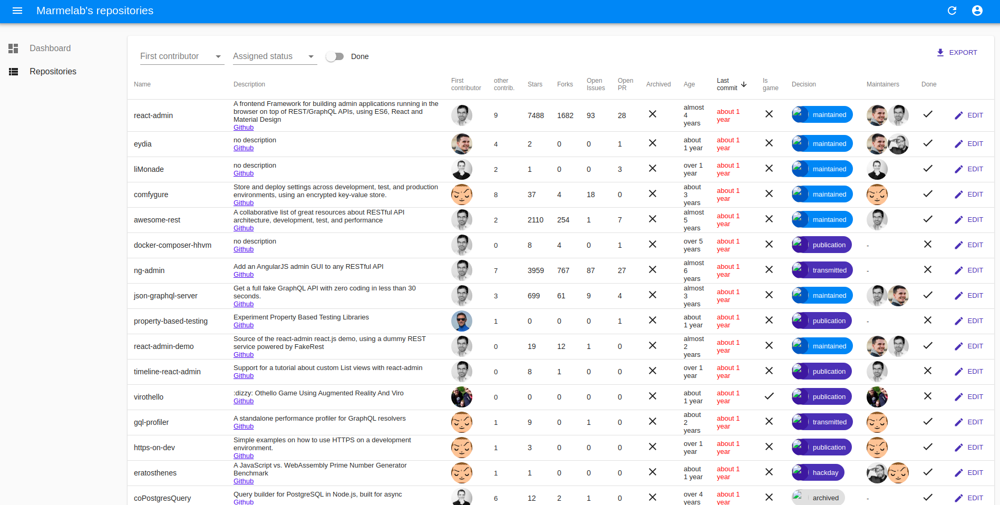
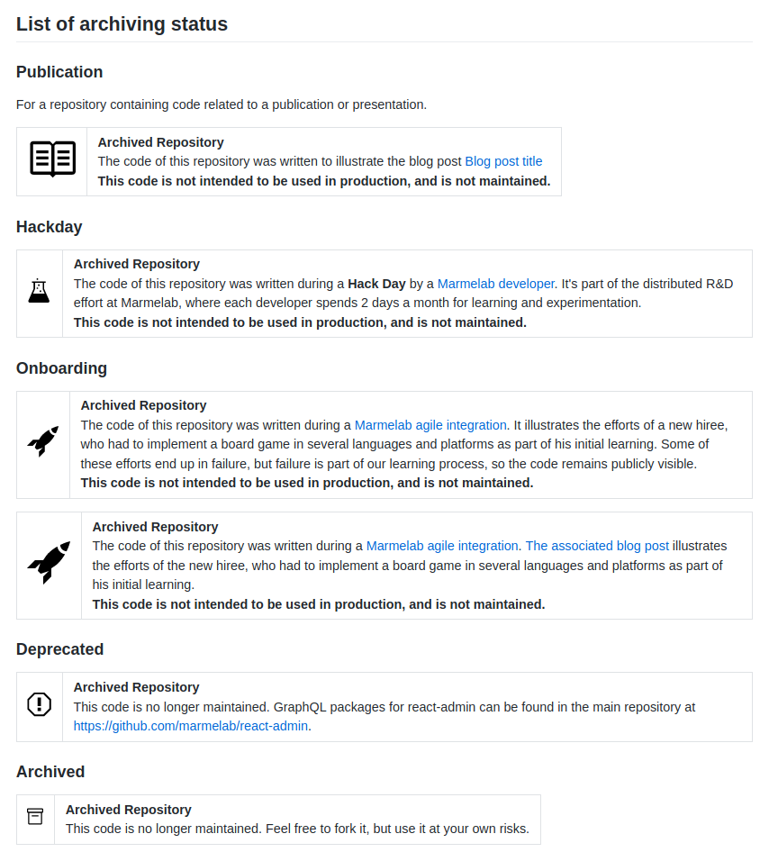
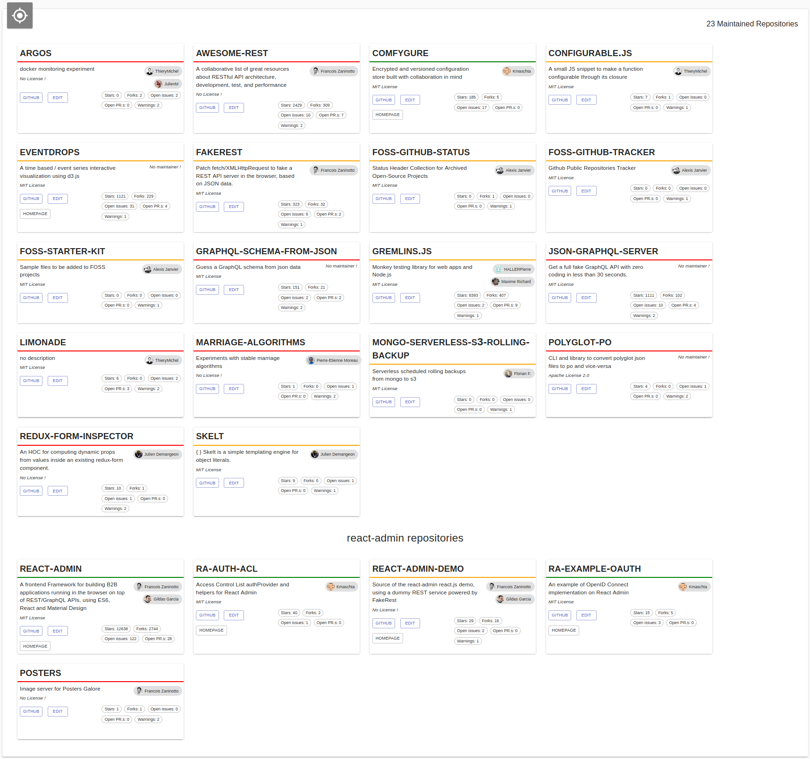
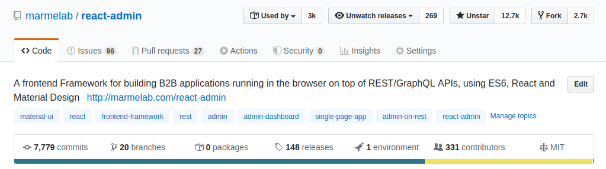

+++
title="Nettoyage de printemps de nos projets open-source"
slug="nettoyage-de-printemps-sur-nos-projets-open-source"
date = 2020-05-13
description="On trouve plus de 200 dépôts publics sur notre compte Github. Est-ce à dire que nous maintenons plus de 200 projets open-source ? Non, un petit nettoyage s'imposait..."
draft = false
in_search_index = true
[taxonomies]
categories = ["informatique"]
tags = ["foss"]
[extra]
marmelab="https://marmelab.com/blog/2020/05/13/nettoyage-de-printemps-sur-nos-projets-open-source.html"
+++

Marmelab est une société particulière, et ceci pour plusieurs raisons, notamment sa taille (nous ne sommes _que_ 13 développeurs à ce jour), [ses valeurs](https://marmelab.com/fr/values) ou son mode de [facturation au sprint](/blog/2013/02/11/pour-la-fin-des-contrats-au-forfait.html).

Mais une autre de ses particularités, et non des moindres, est son implication dans **l'open-source**.

La preuve ? Hormis les projets clients, nous partageons presque tout ce que nous codons sur [Github](https://github.com/marmelab). Est-il pour autant juste de dire que tous ces dépôts publics sont vraiment de l'open-source ?

## Qu'est-ce qu'un projet open-source ?

Si l'on regarde la [définition qui en est faite par opensource.org](https://opensource.org/osd), on peut tout d'abord noter que

> *"Open source doesn't just mean access to the source code."*

Formellement, du code ne peut pas être considéré comme open-source tant qu'il n'est pas associé à une [licence](https://choosealicense.com/). Ce sujet des licences est très important et pour peu que l'on creuse un peu, passionnant. C'est par exemple un point de distinction entre l'open-source et le [logiciel libre](https://www.gnu.org/philosophy/open-source-misses-the-point.fr.html).

Mais ce n'est pas le sujet de ce post de blog. Retenons juste qu'un code n'est pas open-source sans une licence indiquant qu'il l'est. Et que dans la cadre de l'open-source Marmelab, nous utilisons une licence [MIT](https://fr.wikipedia.org/wiki/Licence_MIT).

Pour autant, une licence est-elle suffisante ? D'un point de vue légal, sans doute, mais du point de vue de Marmelab, non. Pour être open-source, nous considérons que :

* **Le projet doit avoir du sens**, un sens explicable et expliqué (dans le fichier [README](https://www.makeareadme.com/)).
* **Le projet doit être maintenu.**, c'est à dire à jour s'il dépend de librairies externes. Les bugs remontés par des utilisateurs doivent être résolus, et les propositions de modification de code proposées par la communauté au minimum relues.
* **Le projet doit être testé.**
* **Le projet doit être documenté.**

Nous ne sommes bien évidemment pas les seuls à intégrer ces exigences dans la définition d'un projet open-source. Preuves en sont les sites [Open Source Guides](https://opensource.guide/) (Github), [//TODO](https://todogroup.org/#) ou [opensource.dev](https://opensource.dev/) (Google).

## Nos projets publics sur Github

En ce mois de mai 2020, nous pouvons lister **206 projets publics** sur notre compte Github. Et bien évidement, les 206 projets ne respectent pas tous la définition de l'open-source que nous venons de donner. Parmi tous ces dépôts, nous trouvons :

* des forks de projets sur lesquels nous avions proposé des PR,
* des projets obsolètes basés sur des technologies que nous n'utilisons plus,
* des projets [d'intégration](https://marmelab.com/blog/2018/09/05/agile-integration.html),
* des projets expérimentaux réalisés lors de nos [hackdays](https://marmelab.com/fr/jobs),
* ...le_reste

Nous avons donc consacré une journée à recenser ces projets et isoler quelques métriques (le nombre de stars, le nombre d'issues ouvertes, la date de dernière activité, le nombre de forks ...) pour pouvoir faire collectivement le tri.

Nous avons opté pour une classification en 6 grandes catégories :

* **publication** : les dépôts liés à des publications (codes illustrant des articles de blog, des conférences...),
* **onboarding** : les dépôts liés aux projet d'intégration chez Marmelab,
* **hackday** : les dépôts liés aux hackdays,
* **transmitted** : les dépôts que nous ne souhaitions plus maintenir mais pouvant être maintenus par d'autres,
* **archived** : les dépôts que nous ne souhaitions plus maintenir,
* **maintained** : les dépôts constituant les *"vrais"* projets open-source.

Tous les dépôt autres que **maintained** n'ayant plus à être officiellement maintenus ont été déclarés comme archivés sur Github. Pour cela, nous leur avons ajouté un cartouche indiquant clairement notre choix de ne plus les maintenir.

*Le code de ces cartouches est disponible sur Github: [marmelab/foss-github-status](https://github.com/marmelab/foss-github-status)*

À la fin de ce grand nettoyage, nous avions :

23 projets (11%) ont donc été réellement classés comme open-source sur les 206 dépôts publics. Cela peut sembler peu, mais pour rappel, c'est presque deux fois plus que le nombre de développeurs chez Marmelab !

*Le code nous ayant servi à faire ce nettoyage et à générer les graphiques et les listes illustrant ce post est disponible sur Github: [marmelab/foss-github-tracker](https://github.com/marmelab/foss-github-tracker)*

## React-admin, le vaisseau amiral de l'open-source chez Marmelab

Parmi tous nos projets maintenus, un projet sort clairement du lot : [React-admin](https://marmelab.com/react-admin/).

Les raisons en sont trop nombreuses pour être détaillées dans cet article : son âge (plus de 5 ans), [son nombre de contributeurs (331)](https://github.com/marmelab/react-admin/graphs/contributors), le nombre d'heures investies dessus par Marmelab (incalculables !), le nombre de [posts de blog](https://marmelab.com/fr/blog#react-admin), le nombre de [conférences](https://www.youtube.com/watch?reload=9&v=NX3puR_kERc)... Et aussi le nombre de stars sur Github : plus de 12 500 à ce jour \o/

## Les autres projets

Malgré le fait que React-admin puisse être en capacité de vampiriser tout l'investissement de Marmelab sur l'open-source, il existe d'autres projets maintenus.

Les raisons en sont très diverses : le besoin d'un outil de développement du quotidien qui n'existait pas encore ([json-graphql-server](https://github.com/marmelab/json-graphql-server)), une appétence pour un type de programmation ([liMonade](https://github.com/marmelab/liMonade)), la mise à disposition d'un algorithme bien senti ([marriage-algorithms](https://github.com/marmelab/marriage-algorithms)), un besoin client particulier ([comfygure](https://github.com/marmelab/comfygure))...

**Aujourd'hui, 18 projets sont maintenus au sein de l'équipe en plus de React-admin.**

Dans une prochaine série d'articles, nous nous intéresserons plus en détails à plusieurs de ces projets avec leur.s mainteneur.s : leur histoire, les problématiques qu'ils adressent, les difficultés et bénéfices induits par leur maintien, les motivations du ou des mainteneurs, les outils utilisés...
