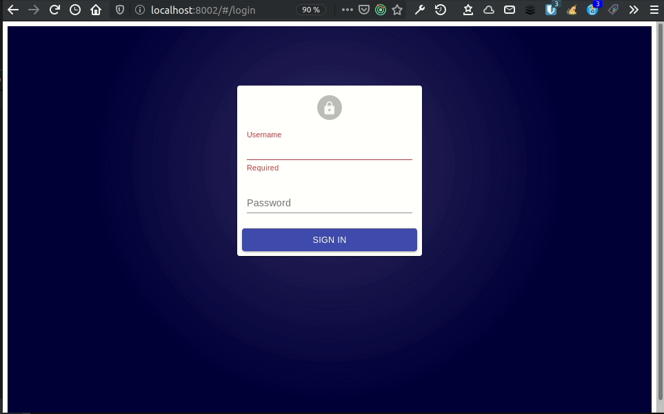
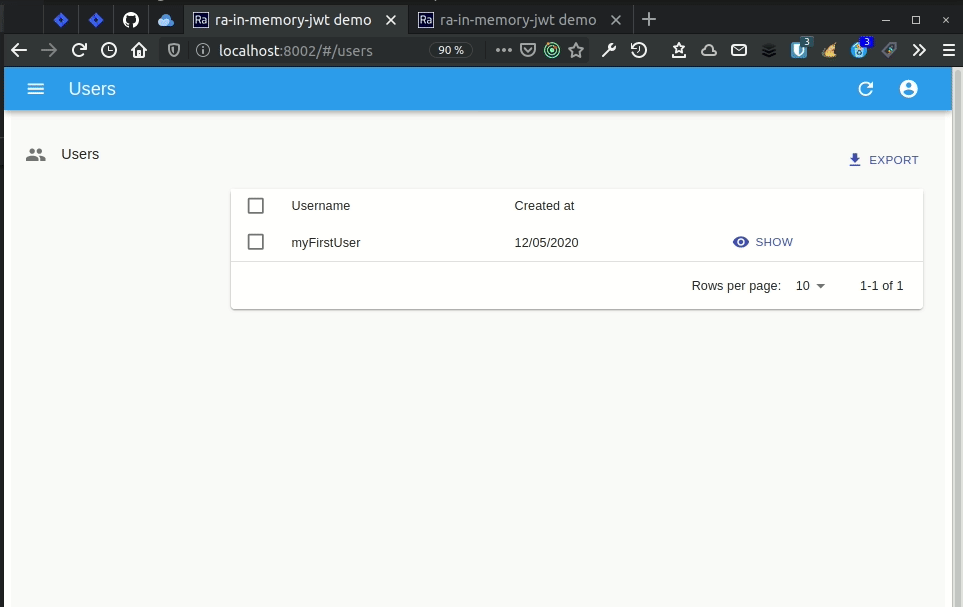
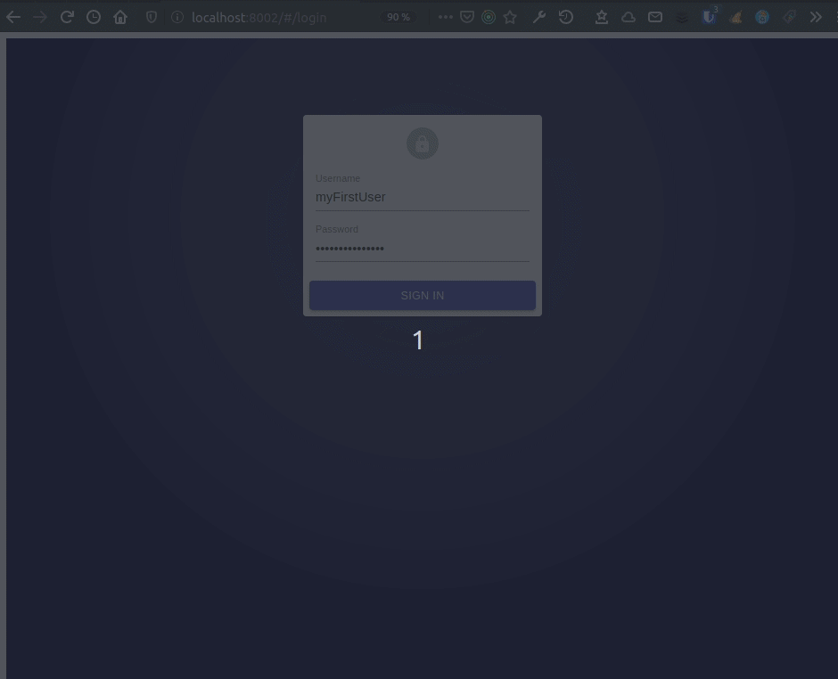
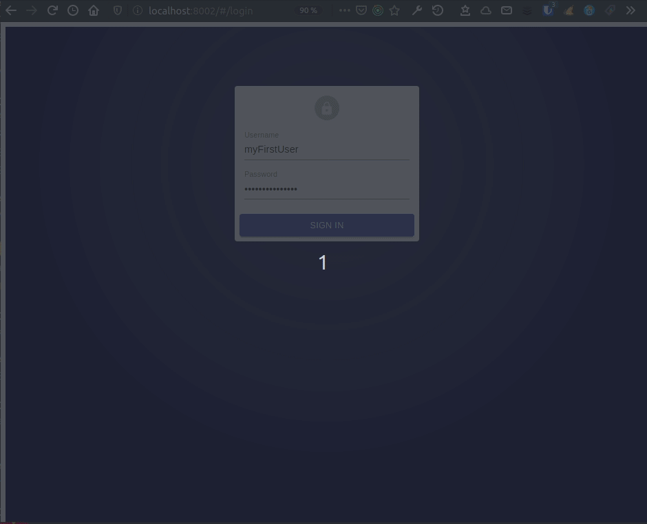

+++
layout: post
title: "Handling JWT in Admin Apps the Right Way"
excerpt: "The best practice regarding JWT storage is to use memory rather than local storage. But it comes with numerous challenges. Let's see how to tackle these in the case of a react-admin application."
cover_image: "./images/jwt-in-memory-cover.jpg"
thumbnail_image: "./images/jwt-in-memory-thumbnail.png"
authors:
- alexis
tags:
- react-admin
- tutorial
- security
- popular
+++

## The Problem: Safely Storing JWT Tokens in React-Admin

Probably by routine or by *Stack Overflow syndrome*, we often use a [JSON Web Token(JWT)](https://tools.ietf.org/html/rfc7519) to manage this authentication between our frontend apps and their API. For convenience, we store this token in the browser's [localStorage](https://developer.mozilla.org/en-US/docs/Web/API/Window/localStorage). But this is not a good practice, as Randall Degges explains in his article ["Please Stop Using Local Storage"](https://dev.to/rdegges/please-stop-using-local-storage-1i04). For the most curious, here is an example of how ["Stealing JWTs in localStorage via XSS"](https://medium.com/redteam/stealing-jwts-in-localstorage-via-xss-6048d91378a0).

But then, how to use a JWT to manage authentication in a more secure way? This blog post will illustrate an implementation of a solution proposed by the [Hasura](https://hasura.io) team in their article [The Ultimate Guide to handling JWTs on frontend clients](https://hasura.io/blog/best-practices-of-using-jwt-with-graphql/). The main concept is to "simply" store this token in memory.

We'll illustrate this with a [react-admin](https://marmelab.com/react-admin/) application. React-admin has a powerful [Authentication Provider subsystem](https://marmelab.com/react-admin/Authentication.html) to manage authentication, independent from the rest of the framework code. 

But it's not so simple!

## The Authentication Route

Let's assume that we have an API with a `/authenticate` endpoint, which returns a JWT on success. Here is an example implementation of such a server route with [Koa](https://koajs.com/) and  [node-jsonwebtoken](https://github.com/auth0/node-jsonwebtoken#readme) :

```javascript
router.post('/authenticate', async (ctx) => {
    const { username, password } = ctx.request.body;

    const user = await getOneByUsername(username);

    if (!user || user.error) {
        ctx.throw(401, user ? user.error : 'Invalid credentials.');
        return;
    }

    if (!bcrypt.compareSync(password, user.password)) {
        ctx.throw(401, 'Invalid credentials.');
        return;
    }

    const token = jwt.sign({ username }, config.security.jwt.secretkey, {
        expiresIn: config.security.jwt.expiration,
    });

    ctx.body = { token };
});

```

*This code is basic. You can find a more complete example in the [marmelab/ra-in-memory-jwt](https://github.com/marmelab/ra-in-memory-jwt/tree/master/demo) demo.*

## Storing The JWT In Memory

The following frontend code shows a way to store the JWT in memory, rather than in the local storage:

```javascript
// inMemoryJwt.js
const inMemoryJWTManager = () => {
    let inMemoryJWT = null;

    const getToken = () => inMemoryJWT;

    const setToken = (token) => {
        inMemoryJWT = token;
        return true;
    };

    const ereaseToken = () => {
        inMemoryJWT = null;
        return true;
    }

    return {
        ereaseToken,
        getToken,
        setToken,
    }
};

export default inMemoryJWTManager();
```

We take advantage of a [closure](https://developer.mozilla.org/en-US/docs/Web/JavaScript/Closures) to instantiate the `inMemoryJWT` variable holds our JWT in memory.

## Integrating JWT With The React-Admin AuthProvider

Let's now see how to use this `inMemoryJWTManager` in a simple React-admin application. First, we declare an `App` :

```javascript
// App.js
import React from 'react';
import { Admin, Resource } from 'react-admin';

import myDataProvider from './dataProvider';
import authProvider from './authProvider';
import usersConfiguration from './users';

const dataProvider = myDataProvider('http://localhost:8001/api');
const App = () => (
    <Admin authProvider={authProvider} dataProvider={dataProvider}>
        <Resource name="users" {...usersConfiguration} />
    </Admin>
);

export default App;
```

Then, we have to configure the React-admin authentication provider:

```javascript
// in authProvider.js
import inMemoryJWT from './inMemoryJWT';

const authProvider = {
    login: ({ username, password }) => {
        const request = new Request('http://localhost:8001/authenticate', {
            method: 'POST',
            body: JSON.stringify({ username, password }),
            headers: new Headers({ 'Content-Type': 'application/json' })
        });
        return fetch(request)
            .then((response) => {
                if (response.status < 200 || response.status >= 300) {
                    throw new Error(response.statusText);
                }
                return response.json();
            })
            .then(({ token }) => inMemoryJWT.setToken(token));
    },
    logout: () => {
        inMemoryJWT.ereaseToken();
        return Promise.resolve();
    },

    checkAuth: () => {
        return inMemoryJWT.getToken() ? Promise.resolve() : Promise.reject();
    },

    checkError: (error) => {
        const status = error.status;
        if (status === 401 || status === 403) {
            inMemoryJWT.ereaseToken();
            return Promise.reject();
        }
        return Promise.resolve();
    },

    getPermissions: () => {
        return inMemoryJWT.getToken() ? Promise.resolve() : Promise.reject();
    },
};

export default authProvider;
```

Now, we have to configure the React-admin data provider. Indeed, it's this `dataProvider` that will be in charge of transmitting the JWT to the API, via an `Authorization` http header:

```javascript
// in dataProvider.js
import { fetchUtils } from 'ra-core';
import inMemoryJWT from 'ra-in-memory-jwt';

export default (apiUrl) => {
    const httpClient = (url) => {
        const options = {
            headers: new Headers({ Accept: 'application/json' }),
        };
        const token = inMemoryJWT.getToken();
        if (token) {
            options.headers.set('Authorization', `Bearer ${token}`);
        }

        return fetchUtils.fetchJson(url, options);
    };

    return {
        getList: (resource, params) => {
            const url = `${apiUrl}/${resource}`;
            return httpClient(url).then(({ headers, json }) => {
                return {
                    data: json,
                    total: headers.get('x-total-count'),
                };
            });
        },
        getOne: (resource, params) =>
            httpClient(`${apiUrl}/${resource}/${params.id}`).then(({ json }) => ({
                data: json,
            })),
        getMany: () => Promise.reject(),
        getManyReference: () => Promise.reject(),
        update: () => Promise.reject(),
        updateMany: () => Promise.reject(),
        create: () => Promise.reject(),
        delete: () => Promise.reject(),
        deleteMany: () => Promise.reject(),
    };
};
```

Our application is already functional and secure. The JWT is no longer visible in the browser's `localStorage`.

## Limitations Of The Memory Storage

But the user experience is not good enough. For instance, when a user reloads the page:



Or when users disconnect from one tab while they're also connected to a second one:



Where do these problems come from, and how can we fix them?

## Supporting Several Tabs With Local Storage

When the JWT is stored in the `localStorage`, two React-admin sessions launched in two tabs will be able to share this JWT. And when user disconnects, deleting the JWT in the `localStorage` will impact both tabs.

This is no longer the case when the JWT is stored in memory because each instance of React-admin will manage the storage of the JWT independently of each other.

The solution proposed in the article ["The Ultimate Guide to handling JWTs on frontend clients"](https://hasura.io/blog/best-practices-of-using-jwt-with-graphql/) is quite clever, and uses ... the `localStorage` :)

```javascript
// inMemoryJwt.js
const inMemoryJWTManager = () => {
    let inMemoryJWT = null;

    // This listener allows to disconnect another session of react-admin started in another tab
    window.addEventListener('storage', (event) => {
        if (event.key === 'ra-logout') {
            inMemoryJWT = null;
        }
    });

    const getToken = () => inMemoryJWT;

    const setToken = (token) => {
        inMemoryJWT = token;
        return true;
    };

    const ereaseToken = () => {
        inMemoryJWT = null;
        window.localStorage.setItem('ra-logout', Date.now());
        return true;
    }

    return {
        ereaseToken,
        getToken,
        setToken,
    }
};

export default inMemoryJWTManager();
```

Thus, when the user logs out from a tab, the memory manager generates an event on the `ra-logout` localStorage's item, that is listened by all instances of `inMemoryJWT`.

## Using Short-Lived Tokens For Better Security

An important idea when securing JWTs is to have tokens with a limited lifetime. Let's say 5 minutes. So, if despite all our efforts, this token is stolen, it won't be valid for a very long time. That means that even if the user doesn't reload their page, the session will stop when the token is no longer valid. This implies very short user sessions.

But then, how to keep this level of security without asking users to log in again every five minutes? Well, with a cookie! But here, we'll have to use a very secure cookie ([httpOnly](https://developer.mozilla.org/en-US/docs/Web/HTTP/Cookies#Secure_and_HttpOnly_cookies), [SameSite](https://web.dev/samesite-cookies-explained/), etc ...). This cookie will be used to get a new *fresh* JWT before the current one expires.

First, this will induce additional code in backend to:

1. Return the token lifetime in addition to the token. We could do this by decoding the token on the frontend side, but that involves useless manipulation!
2. Set a `refresh-token` cookie during authentication.
3. Implement a new `/refresh-token` endpoint.

The new `refresh-token` cookie will allow to query the new endpoint `/refresh-token`. When the frontend queries this route, and in case the `refresh-token` cookie is still valid, the endpoint should return a new fresh JWT that will replace the outdated one.

> I don't detail here the API side implementation, but you can find a more complete example in the demo code of the [marmelab/ra-in-memory-jwt](https://github.com/marmelab/ra-in-memory-jwt/tree/master/demo) repository

But let's see how it'll work on the React-admin application side.

```javascript
const inMemoryJWTManager = () => {
    let logoutEventName = 'ra-logout';
    let refreshEndpoint = '/refresh-token';
    let inMemoryJWT = null;
    let refreshTimeOutId;

    // This listener allows to disconnect another session of react-admin started in another tab
    window.addEventListener('storage', (event) => {
        if (event.key === logoutEventName) {
            inMemoryJWT = null;
        }
    });

    const setRefreshTokenEndpoint = endpoint => refreshEndpoint = endpoint;

    // This countdown feature is used to renew the JWT in a way that is transparent to the user.
    // before it's no longer valid
    const refreshToken = (delay) => {
        refreshTimeOutId = window.setTimeout(
            getRefreshedToken,
            delay * 1000 - 5000
        ); // Validity period of the token in seconds, minus 5 seconds
    };

    const abordRefreshToken = () => {
        if (refreshTimeOutId) {
            window.clearTimeout(refreshTimeOutId);
        }
    };

    // The method makes a call to the refresh-token endpoint
    // If there is a valid cookie, the endpoint will return a fresh jwt.
    const getRefreshedToken = () => {
        const request = new Request(refreshEndpoint, {
            method: 'GET',
            headers: new Headers({ 'Content-Type': 'application/json' }),
            credentials: 'include',
        });
        return fetch(request)
            .then((response) => {
                if (response.status !== 200) {
                    ereaseToken();
                    global.console.log(
                        'Failed to renew the jwt from the refresh token.'
                    );
                    return { token: null };
                }
                return response.json();
            })
            .then(({ token, tokenExpiry }) => {
                if (token) {
                    setToken(token, tokenExpiry);
                    return true;
                }

                return false;
            });
    };


    const getToken = () => inMemoryJWT;

    const setToken = (token, delay) => {
        inMemoryJWT = token;
        refreshToken(delay);
        return true;
    };

    const ereaseToken = () => {
        inMemoryJWT = null;
        abordRefreshToken();
        window.localStorage.setItem(logoutEventName, Date.now());
        return true;
    }

    const setLogoutEventName = name => logoutEventName = name;

    return {
        ereaseToken,
        getToken,
        setLogoutEventName,
        setRefreshTokenEndpoint,
        setToken,
    }
};

export default inMemoryJWTManager();
```

```javascript
//in authProvider.js
//...
const authProvider = {
    login: ({ username, password }) => {
        const request = new Request('http://localhost:8001/authenticate', {
            method: 'POST',
            body: JSON.stringify({ username, password }),
            headers: new Headers({ 'Content-Type': 'application/json' }),
            credentials: 'include',
        });
        inMemoryJWT.setRefreshTokenEndpoint('http://localhost:8001/refresh-token');
        return fetch(request)
            .then((response) => {
                if (response.status < 200 || response.status >= 300) {
                    throw new Error(response.statusText);
                }
                return response.json();
            })
            .then(({ token, tokenExpiry }) => inMemoryJWT.setToken(token, tokenExpiry));
    },
//...
```

The idea is quite simple: after fetching the JWT, we call `refreshToken()`, which starts a *timeout* for another function, `getRefreshedToken`, which will call the endpoint `/refresh-token` 5 seconds before the JWT expires (defined in `window.setTimeout` delay props).

It is thus the cookie's lifetime which will determine the duration of the user's session, rather than the JWT's lifetime.


## Persisting Sessions Across Reloads

The code we have just seen allows to have an authenticated session longer than the JWT's lifetime, but it doesn't allow to maintain the session when the page is reloaded.

To reach this result, it should be enough to make a call to the `/refresh-token` endpoint when checking the user's authorizations (the `checkAuth` of the `authProvider`):

```javascript
//in authProvider.js
//...
    checkAuth: () => {
        console.log('checkAuth');
        if (!inMemoryJWT.getToken()) {
            inMemoryJWT.setRefreshTokenEndpoint('http://localhost:8001/refresh-token');
            return inMemoryJWT.getRefreshedToken().then(tokenHasBeenRefreshed => {
                return tokenHasBeenRefreshed ? Promise.resolve() : Promise.reject();
            });
        } else {
            return Promise.resolve();
        }
    },
```

## Solving Optimistic Rendering Problems

This solution works. But it's not a very satisfactory one:



Due to its [optimistic rendering](https://medium.com/@whosale/optimistic-and-pessimistic-ui-rendering-approaches-bc49d1298cc0) system, React-admin fetches data for the current view (in our example, a list view) **before** the `checkAuth` promise returns. So, this fetch will be done without the JWT, and return a 401, leading to a redirection to the authentication page (caused by the `checkError` method of the `authProvider`). The login page will "take advantage" of the JWT finally returned and will therefore ... redirect to the original view.

Several solutions are conceivable to solve this problem, according to your needs.

Sometimes some routes don't need JWT tokens. This is the case if you use React-admin to display some views (the `list` or `show` view) as public view (without authentication).

But for our example, we consider that all views require authentication. As all endpoints need a token to work, we could implement the fetch to the `/refresh-token` endpoint directly into the http client:

```javascript
// in dataProvider

const httpClient = (url) => {
    const options = {
        headers: new Headers({ Accept: 'application/json' }),
    };
    const token = inMemoryJWT.getToken();

    if (token) {
        options.headers.set('Authorization', `Bearer ${token}`);
        return fetchUtils.fetchJson(url, options);
    } else {
        inMemoryJWT.setRefreshTokenEndpoint('http://localhost:8001/refresh-token');
        return inMemoryJWT.getRefreshedToken().then((gotFreshToken) => {
            if (gotFreshToken) {
                options.headers.set('Authorization', `Bearer ${inMemoryJWT.getToken()}`);
            };
            return fetchUtils.fetchJson(url, options);
        });
    }
};

```

That solves our first problem with the fetch to the list data endpoint that returned a `401`. But it brings another problem: as the `getPermissions` method doesn't have a token, it will trigger a disconnection and then a redirection to login page.

In fact, we have a global race conditions problem between JWT-dependent methods, all these methods may need to make an asynchronous call!

The solution will consist in asking these methods to wait for the end of the possible fetch to the `/refresh-token` endpoint started by the `dataProvider` before returning their answer.

That's why a `waitForTokenRefresh` method must be added to the `inMemoryJWTManager`.

This method returns a resolved promise if no call to the `/refresh-token` is in progress. If a call is in progress, it waits for the fetch resolution before returning the resolved promise.

```javascript
// in inMemoryJWTManager

const inMemoryJWTManager = () => {
    ...
    let isRefreshing = null;

    ...

    const waitForTokenRefresh = () => {
        if (!isRefreshing) {
            return Promise.resolve();
        }
        return isRefreshing.then(() => {
            isRefreshing = null;
            return true;
        });
    }

    const getRefreshedToken = () => {
        const request = new Request(refreshEndpoint, {
            method: 'GET',
            headers: new Headers({ 'Content-Type': 'application/json' }),
            credentials: 'include',
        });

        isRefreshing = fetch(request)
            .then((response) => {
                if (response.status !== 200) {
                    ereaseToken();
                    global.console.log(
                        'Token renewal failure'
                    );
                    return { token: null };
                }
                return response.json();
            })
            .then(({ token, tokenExpiry }) => {
                if (token) {
                    setToken(token, tokenExpiry);
                    return true;
                }
                ereaseToken();
                return false;
            });

        return isRefreshing;
    };

    ...
};
```

The `waitForTokenRefresh` method will therefore be used in the `authProvider`. :

```javascript
// in authProvider.js
    ...

    checkAuth: () => {
        return inMemoryJWT.waitForTokenRefresh().then(() => {
            return inMemoryJWT.getToken() ? Promise.resolve() : Promise.reject();
        });
    },

    ...

    getPermissions: () => {
        return inMemoryJWT.waitForTokenRefresh().then(() => {
            return inMemoryJWT.getToken() ? Promise.resolve() : Promise.reject();
        });
    },
```



## Logging Out Properly 

The last question to be addressed is the logout feature. For the moment, when users log out, as soon as the page reloads, they are connected again!

The only solution is to call a **logout route** from the API, because the only way to invalidate the refresh cookie is through the API!

```javascript
// in authProvider.js

    logout: () => {
        const request = new Request('http://localhost:8001/logout', {
            method: 'GET',
            headers: new Headers({ 'Content-Type': 'application/json' }),
            credentials: 'include',
        });
        inMemoryJWT.ereaseToken();

        return fetch(request).then(() => '/login');
    },
```

## Conclusion: Should You Use JWT For Admins?

The code described in this blog post allows to manage a React-admin authentication using a Json Web Token in a secure way without degrading the user experience. The original idea of this method comes from the Hasura team and I built the implementation with the help from my colleagues [Julien](https://twitter.com/juliendemangeon) and [Gildas](https://twitter.com/gildaspk).

But I'm convinced that using JWT in memory isn't always such a good idea.

The use of the code illustrated in this article brings a lot of complexity. This complexity is surely useless in many cases! You must ask yourself the right question: **Do I really need to use a Json Web Token to manage my application's authentication (with React-admin or not by the way)?**

If you interact for instance with a large system composed of micro-services that use this JWT to share user authentication between different services, then yes, you might want to look into `marmelab/ra-in-memory-jwt`.

But if your React-admin application interacts with a more monolithic API, chances are your authentication doesn't need more than a cookie. As long as you apply the same good security practices used by the one described in this post managing the `/refresh-token` endpoint.
