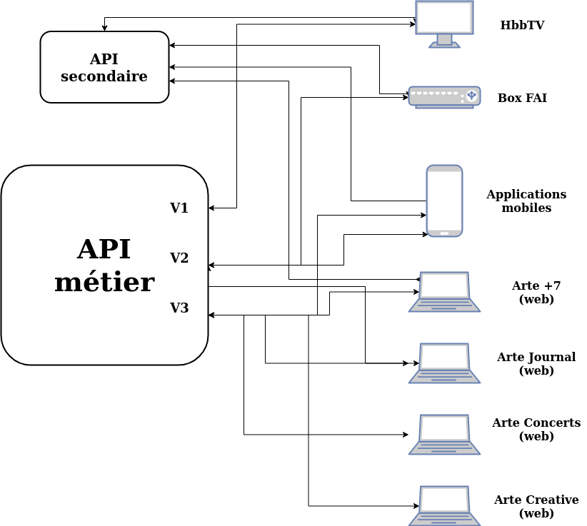
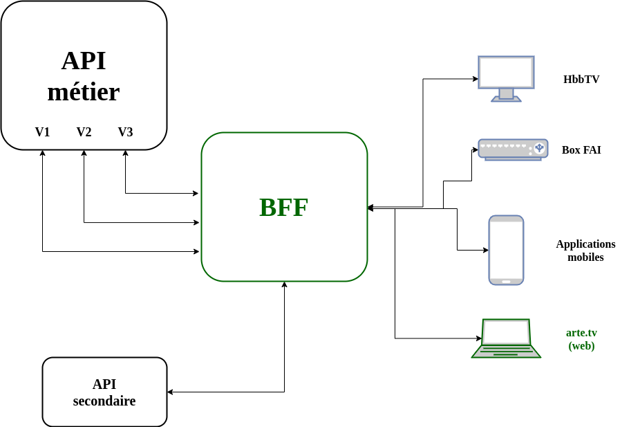
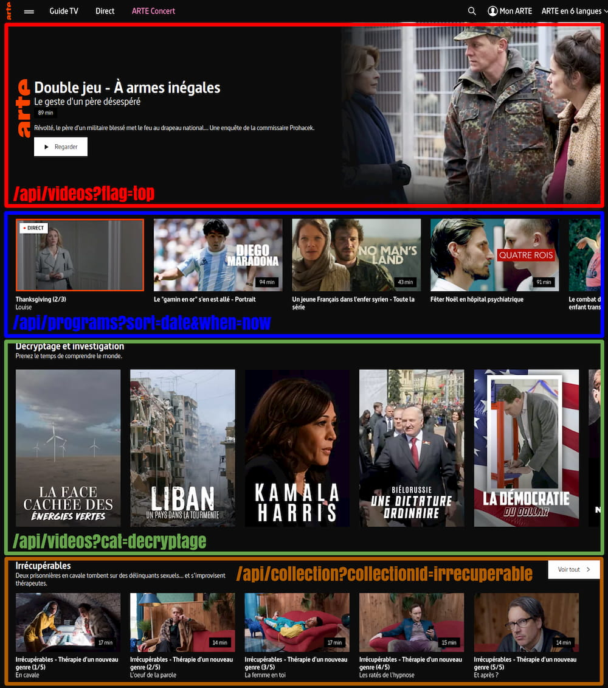
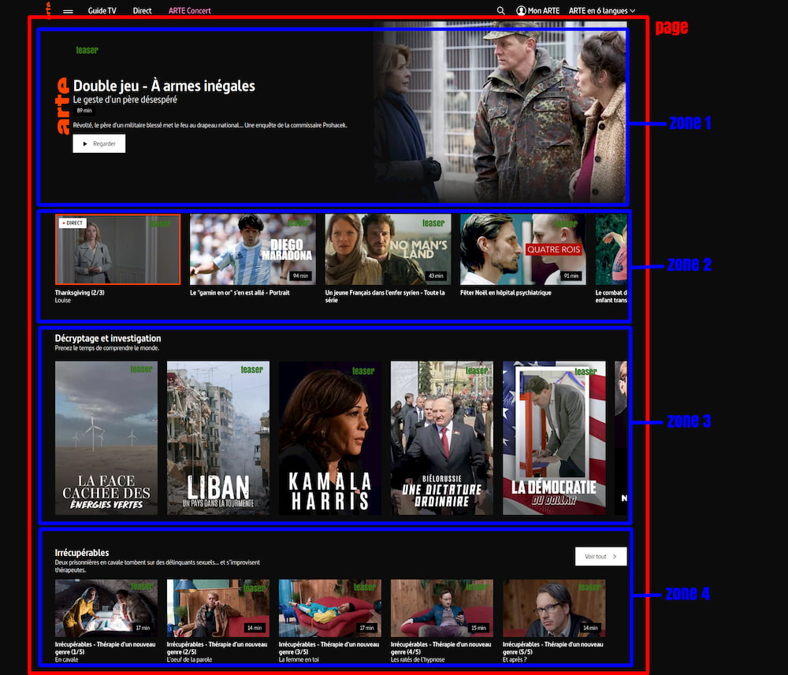
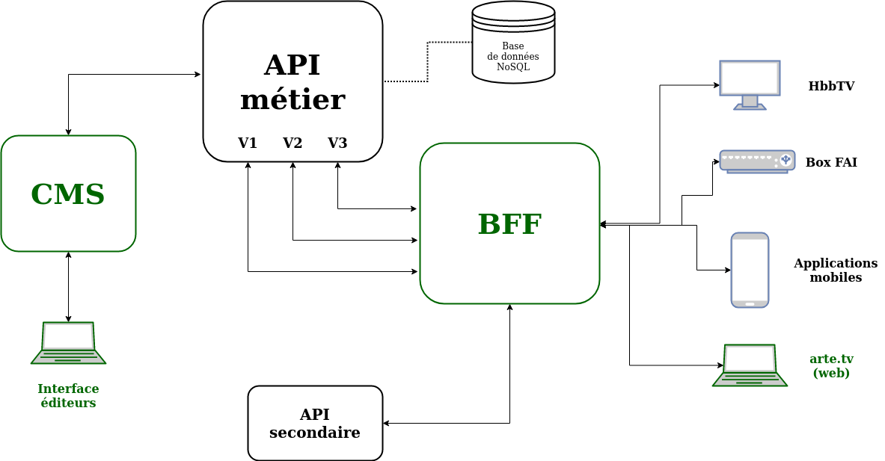
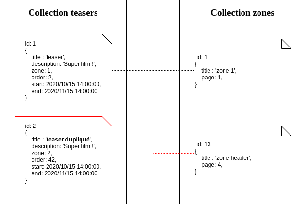
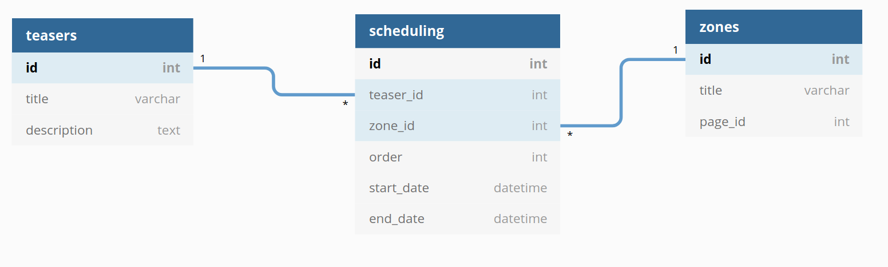

+++
title="Histoire d'une migration chez Arte, partie 1/3 : le contexte"
slug="migration-continue-chez-arte-pourquoi"
date = 2021-01-07
description="Pourquoi nous nous sommes lancés dans un chantier de migration continue"
draft = false
in_search_index = true
[taxonomies]
categories = ["informatique"]
tags = ["architecture", "projet"]
[extra]
marmelab="https://marmelab.com/blog/2021/01/07/migration-continue-chez-arte-pourquoi.html"
+++

Pour les besoins de l’un de nos clients, Arte, nous venons d’effectuer un gros changement d’architecture sur leur système d’information. Ce système d’édition de contenus alimente des interfaces d’administration, mais aussi les applications publiques (web, mobile, HbbTv,…) en production. Il a donc fallu rendre ce changement transparent pour tous les utilisateurs.

Au lieu d’écrire la nouvelle brique, la tester et opérer le basculement complet de l’ancien service vers le nouveau, nous avons décidé d’enregistrer les actions des utilisateurs aussi bien sur le nouveau service que sur l’ancien. Nous appellerons ce système l’**édition en Y**. En s’appuyant sur des [*feature flags*](https://martinfowler.com/articles/feature-toggles.html) nous avons alors réussit à migrer progressivement d’un système à l’autre tout en s’assurant de la cohérence des données générées par cette édition en Y.

Cet article découpé en en trois parties s’attachera :

1. à décrire le contexte ayant conduit à se lancer dans une migration au sein du système d’information,
2. à en décrire [la préparation](https://marmelab.com/blog/2021/01/13/migration-continue-chez-arte-mise-en-place.html),
3. à faire un retour d’expérience pragmatique sur [son déroulement](https://marmelab.com/blog/2021/01/22/migration-continue-chez-arte-action.html).

## Le contexte

*L’architecture de départ et l’histoire de sa mise en place permettent de mieux comprendre le besoin de migration abordé dans cet article.*

Cela fait maintenant plus de trois ans que nous travaillons avec Arte sur le système permettant de fournir les contenus aux différentes plateformes de diffusion numériques de la chaine (hors TNT évidemment). L’un de nos premiers chantiers a consisté en la mise en place d’un **Backend For Frontend** (BFF). Ce projet a déjà été détaillé par [Lucas](https://twitter.com/lucaslegname) et [Maxime](https://twitter.com/rmaximedev) lors du Forum Php 2020. Si le sujet vous intéresse, je vous conseille de regarder [la vidéo de leur intervention](https://marmelab.com/blog/2020/11/18/arte-multi-plateforme.html).

Mais voici très schématiquement en quoi cela a consisté.

L’architecture initiale était constituée d’une grosse API métier, secondée par quelques autres APIs très spécifiques. Ces APIs étaient appelées autant de fois que nécessaire par chaque application front, une page complète pouvant par exemple nécessiter de multiples requêtes à l’API métier.


*Représentation simplifiée de l'architecture initiale*

Le mise en place du BFF a permis de réduire à **un unique appel** les besoins des applications front, toute la complexité des sous-requêtes aux différentes API étant prise en charge par ce nouveau service.



*Représentation de l'architecture après l'ajout du BFF*

***Remarque***: *On le voit sur le schéma, la mise en place du BFF s’est fait en parallèle d’un second chantier consistant à réunir une grande partie des sites web de la chaine (Arte+7, Arte Journal, Arte Concerts, Arte Creative, …) en un seul : [arte.tv](https://www.arte.tv).*

Cette modification d’architecture a doublement simplifié le travail des développements *front* :

1. Il n’y a plus qu’une seule API à appeler,
2. Cette API retourne en un seul appel l’intégralité des informations de la page à afficher.

## La gestion éditoriale des contenus Arte

*La mise en place du BFF s’est en fait accompagnée d’un troisième chantier : la mise en place d’un nouveau système de gestion éditoriale des contenus. Bref, d’un [CMS](https://fr.wikipedia.org/wiki/Syst%C3%A8me_de_gestion_de_contenu).*

Avant le BFF, chaque front devait composer ses pages en réalisant les bons appels API en fonction du contenu souhaité. Selon le type d’appel réalisé, le front ne recevait pas forcément le même type d’objet. Dans le schéma suivant, on constate que l’on appelle des objets`programs`, `videos` et`collections`. Il s’agit de trois objets métiers différents. À charge pour le développeur de bien connaître tous ces objets afin de pouvoir y retrouver les informations nécessaires et pertinentes à l’affichage de la page…


*Les appels API avant la mise en place du BFF*

Le BFF ne retourne plus maintenant qu’un seul objet `page` en un unique appel. Chaque page est découpée en`zones`. Chaque zone porte les informations décrivant l’affichage souhaité de cette zone (un seul ou plusieurs contenus affichés dans la zone, formats des images, affichage ou non des sous-titres, etc ..), mais aussi les contenus à afficher.

```json
{
    "page": "HOME",
    "language": "fr",
    "support": "web",
    "level": 0,
    "title": "ARTE : chaîne télé culturelle franco-allemande - TV direct & replay",
    "description": "Emissions TV, direct, vidéos en replay, ARTE Journal… ",
    "slug": "arte-chaine-tele-culturelle-franco-allemande-tv-direct-and-replay",
    "zones": [
      {
        "title": "Top Teaser",
        "description": null,
        "displayOptions": {},
        "link": {},
        "teasers": [
          {
            "title": "Petite fille",
            "description": "Né garçon, Sasha se vit comme une petite fille.",
            "images": {},
            "duration": 4980,
            "geoblocking": {},
            "ageRating": 0
          }
        ]
      }
    ],
    "stats": {},
    "seo": {}
}
```

*Extrait de l'objet page retourné par le BFF*

Et toujours dans le but de simplifier la vie des développeurs front, il n’y a plus qu’un seul type d’objet à afficher : les **teasers**, qui sont une représentation unifiée de tout programme ARTE.

C’est-à-dire qu’un teaser peut représenter un film, une émission, un concert, une série… J’insiste sur l'objet `teaser`, car il est au cœur du chantier de migration.


*Utilisation de l’objet page après le mise en place du BFF*

Bien évidement, ces objets `page` ne sont pas statiques, et tout le travail des éditeurs d’Arte consiste à les animer quotidiennement : gestion des zones devant apparaître ou non au cours de la journée, mise en avant de certaines zones et programmations des teasers affichés dans chaque zone. Chaque support (web, applications mobiles, [HbbTV](https://fr.wikipedia.org/wiki/Hybrid_Broadcast_Broadband_TV), …) et chaque langue pouvant avoir une programmation spécifique.

Tout ce travail d’animation des pages est réalisé grâce au CMS mis en place sur ce troisième chantier.

<video width="800" controls>
  <source src="cms.mp4" type="video/mp4" />
</video>

*Aperçu de l'interface du nouveau CMS*

## Pourquoi ce nouveau chantier de migration

*La mise en place de ces trois briques (le front web unifié, le BFF et le CMS) a parfaitement répondu aux besoins exprimés. [Mais le temps fit ce que le temps fait toujours](https://www.youtube.com/watch?v=eKk06UMudlc)…*

En parallèle de la mise en place de cette nouvelle architecture du système d’information, [l’audience d’Arte a augmenté très significativement](https://www.leparisien.fr/culture-loisirs/tv/arte-la-tele-de-chainee-qui-gagne-toujours-plus-de-telespectateurs-26-04-2020-8305935.php) ! C’est avant tout dû à la qualité de réalisation des programmes diffusés et à la pertinence de leur choix, à l’énorme travail de l’équipe éditoriale, au travail des graphistes, des développeurs mobiles et j’en passe. Mais notre travail a sans doute aussi participé à cette réussite, et c’est un gros motif de satisfaction !

Pour autant, pas encore de quoi nous reposer sur nos lauriers.

Si j’ai insisté sur tous les bienfaits du BFF du point de vue du développement front, cette brique a une autre qualité : mettre à l’abri les sous-services des tumultes de l’exposition publique.

C’était donc l’occasion de reprendre l’API métier qui, exposée pendant plusieurs années aux besoins d’un très grand nombre d’applicatifs, était devenue très, très, complexe : un versionning massif, des options de requête très fines pour répondre à tous les contextes, une multitude d’objets à gérer… Bref, il s’agissait de lui donner un peu d’amour. Ce qui peut se traduire pour ces briques devenues monolithiques par une décharge d’une partie de leurs responsabilités.

Et je ne l’ai pas encore dit, mais lors des chantiers précédemment décrits, **c’est cette API métier qui avait justement endossé la responsabilité de la persistance des teasers…**



*Représentation de l’architecture avec le CMS et la base documentaire de l’API métier*

Plus important encore, des problématiques métiers ont fini par être remontées par les éditeurs. Et effectivement, certains choix techniques avaient induit des limitations nuisant à leur travail quotidien.

Je ne rentrerai évidemment pas dans les détails de ces différents problèmes, mais je prendrai tout de même un exemple caractéristique : la programmation des teasers dans les zones.

### Le problème de la programmation des teasers

C’est donc l’API métier qui avait la charge de la persistance des teasers. Or cette API utilise une base de données NoSQL, purement « documentaire » donc.

Cette approche document nous a amené à faire porter l’information de programmation du teaser sur une zone par le teaser lui-même. Cela a eu un effet de bord qui initialement ne nous semblait pas critique. Mais cela l’est devenu dans le temps : les éditeurs ont dû dupliquer massivement les teasers.

En effet, pour qu’un éditeur puisse programmer un même teaser dans plusieurs zones, il fallait le dupliquer.


*Duplication des teasers due au modèle NoSQL lorsqu’un éditeur veut lier un même teaser à deux zones différentes*

Régler ce problème sur la base documentaire n’était bien sûr pas impossible, mais réclamait beaucoup de code spécifique et donc de complexité, sur une brique d’API qui au contraire demandait à être simplifiée.

Alors que l’utilisation d’une base relationnelle règle le problème *by design*.


*Solution pour programmer un teaser dans n’importe quelle zone avec une base relationnelle*

Voilà donc une des très bonnes raisons nous ayant poussés à nous lancer dans un nouveau chantier : **la migration des teasers depuis l’API métier et son stockage documentaire vers une nouvelle API de gestion des teasers s’appuyant sur une base relationnelle.**

Encore une fois, ce n’était pas la seule raison, l’éditorialisation des contenus impliquant bien d’autres objets (les pages, les zones, la gestion des droits via des ACL,…). Mais le cas de la programmation des teasers servira de fil rouge pour la suite de cet article.

Suite que vous trouverez dans la seconde partie : « [Migration continue chez Arte : la mise en place](https://marmelab.com/blog/2021/01/13/migration-continue-chez-arte-mise-en-place.html) ».
