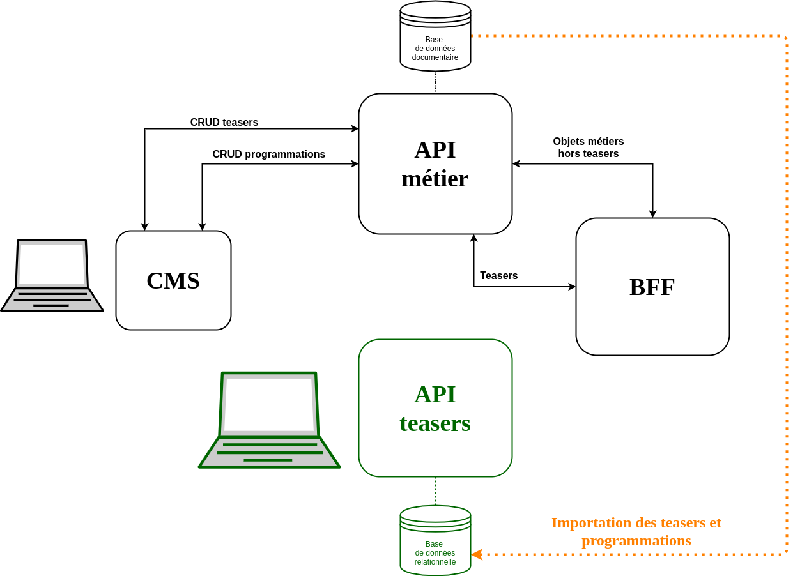
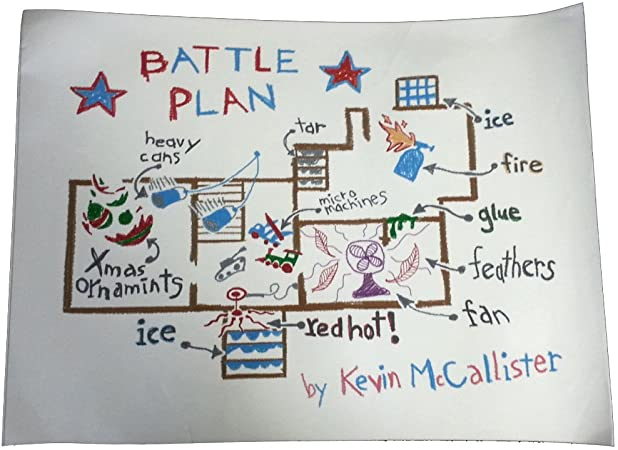

+++
layout: post
title: "Histoire d'une migration chez Arte, partie 2/3 : la mise en place"
excerpt: "Comment nous avons préparé un chantier de migration continue"
cover_image: "./images/migration-arte-2-bootstrap-cover.jpg"
thumbnail_image: "./images/migration-arte-2-bootstrap-thumb.jpg"
authors:
- alexis
tags:
- projet
- architecture
+++

Le [premier article de cette série](https://marmelab.com/blog/2021/01/07/migration-continue-chez-arte-pourquoi.html) à propos de notre travail d'architecture sur le site [Arte.tv](https://www.arte.tv/) a montré comment le choix d’une base de données de type documentaire, initialement pertinent, nous a conduit dans des impasses fonctionnelles. Et pourquoi nous avons donc prévu une migration vers une base de données relationnelle.

Dans cette seconde partie, je vais vous parler des stratégies et des outils mis en place pour opérer cette migration.

## Les contraintes

Si les contraintes techniques d’un passage d’une base de données NoSQL vers une base SQL sont connues, les spécificités métiers doivent aussi être prises en compte lors d’une migration. Maintenir fonctionnel le site en production est évidemment la première contrainte, mais dans notre cas, la gestion de la *temporalité* est aussi un sujet délicat.

L’utilisation d’un *Backend For Frontend* (BFF) facilite l’intervention sur tous les services dont il sert de façade. Chez Arte, il unifie également les réponses retournées à toutes les applications grâce à la mise en place de l’objet "page", constitué de zones contenants des programmations de teasers. Ceci implique donc que travailler sur la brique gérant la programmation des teasers dans les zones, même à l’abri derrière le BFF, est une opération risquée puisqu’elle conditionne le bon fonctionnement de toutes les applications !

La migration de base de données devra donc se passer *sans interruption de service*. C’est une évidence et un problème classique. Et en cas de pépins, notre stack d’intégration et de déploiement nous permet de réaliser un retour en arrière très rapide.

Mais cela répond à la problématique d’une commutation à un instant t : on livre les teasers depuis la nouvelle base de données au lieu de l’ancienne — cela marche, ou pas. Et c’est déjà une belle contrainte. Mais ce n’est pas la plus compliquée à résoudre !

Le processus de gestion des contenus d’Arte se fait dans le temps. Les éditeurs programment les teasers dans les zones, mais peuvent le faire à l’avance ! Une zone n’aura pas le même contenu maintenant, cet après-midi, demain, ou la semaine prochaine.


> Arte est aussi une chaine de télévision, et tout comme comme dans un Télérama, on a une programmation éditoriale des contenus numériques sur une semaine.

Ceci implique que notre bascule de base de données peut fonctionner au moment de cette bascule, mais que l’*on peut ne voir arriver des problèmes qu’au bout de plusieurs jours*. Dans ce cas, même si un rollback technique vers l’ancienne base de données est possible, c’est au risque de perdre tout le travail éditorial réalisé pendant ces quelques jours ! On risque donc en revenant à l’ancienne base de données de se retrouver avec une programmation des zones faussée et des éditeurs légitimement très mécontents. Imaginez que l’on vous efface 3 jours sur vos dépôts git !

**Ce problème de gestion du temps dans le processus éditorial a constitué la plus grosse contrainte dans notre projet de migration.**

## Mise en place d’une nouvelle API

Fort de l’identification du besoin à résoudre et des contraintes de réalisation, nous avons commencé par construire une nouvelle API de gestion des teasers et de leur programmation. Il s’agissait de la partie la plus facile et à priori la moins risquée.

C’est une évidence, partir d’un projet vide est toujours très satisfaisant ! On avance très rapidement, sans contraintes, sans [legacy](https://en.wikipedia.org/wiki/Legacy_code). Et ce fut notre toute première tâche : mettre en place le système de gestion des teasers et de leur programmation s’appuyant sur une base de données relationnelle *from scratch*. Ce nouveau service, indispensable à la suite du projet, pouvait être initialement complètement indépendant de l’infrastructure existante. Cette tâche ne semblait donc pas comporter beaucoup de risques.

Nous sommes partis sur une stack simple et éprouvée avec un backend d’API en [Express](https://expressjs.com/) et une base de données [PostgreSQL](https://www.postgresql.org/). Cette nouvelle API a tout de suite fait l’objet d’un contrat [OpenAPI](https://marmelab.com/blog/2020/04/17/openapi-un-contrat-pour-vos-apis.html). Ce contrat nous a permis de sécuriser nos formats d’entrée et de sortie grâce au composant [express-openapi-validator](https://github.com/cdimascio/express-openapi-validator).



## Importation des données

Mais c’est pourtant l’importation des données existantes vers ce nouveau service qui nous a poussés à adopter une stratégie de migration continue.

Et ce fut la première confrontation au monde réel ! Si l’importation des teasers eux-mêmes n’a pas posé de problème, l’importation des programmations fut moins probante. Nous arrivions, en comparant les programmations en provenance des deux systèmes, à un taux de plus de 40 % d’erreurs ! Certaines zones avaient exactement la bonne programmation, alors que d’autres n’avaient pas de programmation du tout, ou des programmations erronées !

L’explication principale est que l’utilisation des *liaisons entre les teasers et les zones* est très permissive au sein de la base documentaire (puisque portées dans les documents `json`), très loin de la rigueur d’une clé étrangère d’une base relationnelle. Rien n’oblige par exemple à avoir des identifiants de zones uniques ou respectant la même syntaxe. Par exemple, deux zones différentes peuvent avoir le même identifiant, mais une règle d’interprétation spécifique selon la page demandée, ou encore selon l’application (web, application mobile…) ayant réalisé l’appel.

Ce n'était pas vraiment une surprise puisque nous avions nous-mêmes largement profité de cette permissivité pour mettre en place des demandes spécifiques des éditeurs au cours du temps. Mais la conséquence de cela fut une dissémination de règles liant ou non les teasers aux zones, et ce sur les différents services.

Après un travail rigoureux d’identification de ces règles, suivi de leur (ré-)implémentation dans notre script d’importation, nous sommes arrivés à un résultat beaucoup plus satisfaisant avec un taux d’exactitude dépassant les 90 %. Mais n’atteignant pas les 100 %, et toujours en comparant des appels fait à l’instant t.

## La migration continue

Nous étions à un moment charnière du projet.

Nous savions qu’atteindre un taux de 100 % de réussite lors de l’importation nécessiterait d’identifier l’intégralité des règles métiers, mais aussi leurs éventuels effets conjugués. Et que cela risquait de nous prendre un temps conséquent, mais difficilement estimable ! D’autant plus que pour obtenir une réussite de 100 % lors de l’import, il faudrait faire en sorte que les scripts de comparaisons puissent comparer les résultats dans le temps : le temps t, t + 5 heures, le lendemain, la semaine prochaine… Bref, un travail colossal pour se donner l’assurance de pouvoir opérer une bascule brutale entre les deux systèmes.

**Nous avons donc décidé de voir les choses autrement. Plutôt que de poursuivre une hypothétique importation sans erreurs de l’existant, nous avons décidé d’adopter une stratégie de migration continue, nous permettant d’ajuster dans le temps le comportement de la nouvelle API.**

Et pour cela, nous avons opté pour un système d’édition en Y sur cette nouvelle API.

## L’édition en Y

Pour pouvoir opérer à tout moment un rollback lors du passage vers la nouvelle API des teasers, nous avons mis en place une stratégie nous permettant de maintenir la donnée cohérente *sur les deux systèmes de persistance* tout au long de la migration. Pour cela, nous avons mis en place une édition en Y très facile à comprendre.

L’idée est très simple : toute opération [CRUD](https://fr.wikipedia.org/wiki/CRUD) (pour create, read, update, delete) réalisée sur le nouveau système doit être répliquée sur l’ancien système.


Mais si le principe est simple, sa mise en pratique est plus compliquée pour deux raisons :

1. Il faut systématiquement traduire le nouveau modèle relationnel vers l’ancien modèle documentaire. Mais la majorité des méthodes de transformation ont cependant été écrites lors de la phase d’importation.
2. Les risques d’erreurs sont multipliés, car nous devons interagir avec deux systèmes de stockage en parallèle. Et nous ne pouvons pas profiter des transactions PostgreSQL, nous obligeant à mettre en place de mécanismes de rollback en cas d’erreur sur l’un des deux systèmes.

La mise en place de cette édition en Y a été un travail assez couteux en temps, ne serait-ce que pour pouvoir tester (dans le sens tests fonctionnels automatisés) tous les workflows CRUD, leurs cas d’erreurs potentiels et la stratégie de rollback à opérer.

Pour vous faire une idée, voici un cas de test pour l’édition d’un teaser :

1. j'envoie un teaser édité valide à l'API,
2. je vérifie que ce teaser existe bien dans la base relationnelle,
3. je vérifie que ce teaser existe bien sur l'API métier,
4. je sauve les modifications dans la base relationnelle,
5. je sauve les modifications transformées sur l'API métier,
6. l'API métier retourne une erreur (408 Request Timeout),
7. j'annule la modification du teaser sur la base relationnelle,
8. je journalise l'erreur réseau de l'API métier,
9. je retourne une erreur explicite pour l'utilisateur.

Un travail couteux donc, mais qui est le corolaire à notre décision d’opérer une migration continue.

## Une nouvelle interface d’édition… identique

Effet de bord de l’édition en Y, nous avons dû développer une nouvelle interface d’édition bridée. Frustrant.

Puisque nous avions une nouvelle API, nous avions besoin d’une nouvelle interface d’édition adaptée à cette nouvelle API. Mais notre stratégie de migration continue et de son édition en Y nous a obligés à refaire cette nouvelle interface identique à la première, l’édition sur l’API métier étant limitante. Nous ne pouvions par exemple pas mettre en place une interface permettant de programmer un même teaser sur plusieurs zones, l’ancienne API ne le permettant pas. Mais aussi, afin de pouvoir rendre la migration transparente pour les éditeurs, il ne fallait pas que cette interface diffère de la première.


Cela a pourtant eu au moins un effet de bord heureux : nous pouvions réutiliser nos tests [end-to-end](https://en.wikipedia.org/wiki/End-to-end_principle) mis en place sur l’ancienne interface.

Pour réaliser cette interface d’édition, nous avons utilisé [React Admin](https://marmelab.com/react-admin/). Certes, nous connaissons très bien cet outil, mais il n’en reste pas moins que cela a été un gain de temps substantiel sur un projet déjà très long en développement. La version 3, avec tous ses hooks, nous a permis de rester [*ra idiomatique*](https://fr.wikipedia.org/wiki/Idiomatisme) contrairement à l’ancienne interface réalisée avec React Admin V2 pour laquelle nous avions eu très largement recours à [ra-core](https://github.com/marmelab/react-admin/blob/master/packages/ra-core/README.md) (le cœur de react-admin) pour pouvoir répondre aux spécificités de l’interface. Mais cette utilisation massive de ra-core nous interdisait une migration vers la nouvelle version 3, sauf à réécrire une majorité du code. Ce que nous avons fait au final avec cette nouvelle interface d’édition.

Un grand bravo à la core-team de react-admin !

## L’utilisation de feature flags

Comment maintenant faire interagir l’ensemble des services de l’infrastructure d’Arte avec notre nouvelle API, sans en interrompre le fonctionnement quotidien ? Et bien avec des feature flags !

Vous l’aurez sûrement deviné, mais cette préparation de la migration ne s’est pas faite en 1 jour. Ni en une semaine, mais sur plusieurs mois. Et pendant ce temps-là, le travail quotidien sur les sites d’Arte continuait. Il a donc fallu préparer la migration en parallèle de ce travail d’entretien et d’évolution du système en production.

La solution consistant à faire des branches de développement spécifiques sur un temps long est évidemment une solution à éviter. Pour résoudre ce problème de mise en production continue, même avec du code devant être inactif, il existe un pattern bien connu et éprouvé : [le feature flag](https://www.martinfowler.com/articles/feature-toggles.html).


Pour faire très simple, un feature flag est un paramètre de configuration d’un projet, qui indiquera selon sa valeur de faire quelque chose, ou pas.

Nous nous sommes appuyés sur le projet [convict](https://github.com/mozilla/node-convict) de Mozilla. Convict permet de gérer, documenter et valider sa configuration de projet Node, et permet d’obtenir ces valeurs de configuration depuis les variables d’environnement des serveurs. Cela tombe bien, nous essayons de respecter au mieux les préconisations de la méthodologie [twelve-factor app](https://12factor.net/config) sur tous les services Arte.

Voici à quoi cela ressemble :

```js
// in config.js
const convict = require('convict');

const config = convict({
    featureFlags: {
        migrationStep: {
            doc: 'current step of teasers migration, as describe in ADR',
            format: Integer,
	    values: [0,1,2,3,4],
            default: 0,
            env: 'FF_MIGRATION_TEASERS_STEP',
        },
    },
}

config.validate({ allowed: 'strict' });

module.exports = config.getProperties();
```

```js
// in teasers/router.js
const express = require('express');

const config = require('../config');
const { create, createWithY } = require('./repository');

const app = express();

app.post('/teasers', async (req, res) => {
    let newTeaser;
    if (config.featureFlags.migrationStep < 4) {
	    newTeaser = await createWithY(req.body);
    } else {
	    newTeaser = await create(req.body);
    }

    return res.json(newTeaser);
});

```

> Lors de la mise en place de ces feature flags, une bonne idée, très simple, a émergé : n’utiliser qu’un seul feature flag pour commander la migration sur l’ensemble des projets impliqués.

Cet unique feature flag, pouvant prendre un nombre fini de valeurs correspondant aux étapes de notre migration, conditionnait l’exécution du code sur l’ensemble des services. L’état global du système s’en est trouvé grandement clarifié, chaque serveur étant configuré via une unique variable d’environnement sur une étape précise de la migration.

## Un plan de bataille

Dernier élément à ajouter à nos outils avant de nous lancer dans la migration : le plan de migration.

La phase de migration proprement dite, c’est-à-dire le moment de bascule entre l’API métier et la nouvelle API de programmation des teasers, devra donc s’effectuer en continu, c’est-à-dire par étapes, afin de nous permettre de faire des ajustements ciblés à chaque étape, sans interrompre ni les applications ni le travail des éditeurs. Et chaque éventuel retour en arrière devra pouvoir se faire sans perte de données.

Si nous avons tout fait pour que cela soit transparent, le bon déroulé des différentes étapes nécessitait au minimum que les éditeurs et les responsables de l’API métier soient tenus au courant de l’avancement de cette migration.



Nous avions donc eu besoin d’un plan de migration indiquant pour chaque étape les prérequis, les manipulations à effectuer, les données à surveiller pour valider ou non l’étape, et l’impact éventuel que cela pouvait avoir sur le travail des éditeurs.

Nous avons largement documenté ce plan de migration dans un [ADR](https://marmelab.com/blog/2020/10/07/gagner-estime-futurs-developpeurs-redigeant-adr.html) (Architectural Decision Record).

Voilà brièvement à quoi cela ressemble :

```markdown

### Etape X : Titre de l'étape

#### Explication

Un résumé de ce en quoi consiste cette étape

#### Actions à effectuer pour passer en étape X

-   Prévenir les éditeurs de ne pas éditer les teasers pendant une demi-journée
-   Importer les teasers et la programmation dans l'API Teaser
-   ...

#### Validation de l'étape X

-   Script de validation
-   Tests de montée en charge
-   ...

#### Impact pour les éditeurs

-   Prévenir les éditeurs de ne pas éditer les teasers pendant une demi journée
-   Transparent au niveau de l'interface

#### Durée estimée ou à prévoir (par sécurité)

Entre 1 jour et 6 mois ^^
```

Tout est maintenant en place, et pourtant, la migration n’a pas réellement encore commencé. C’est cette dernière phase que je vais aborder dans la troisième et dernière partie de cet article : « [Migration continue chez Arte : action](https://marmelab.com/blog/2021/01/22/migration-continue-chez-arte-action.html) ».
