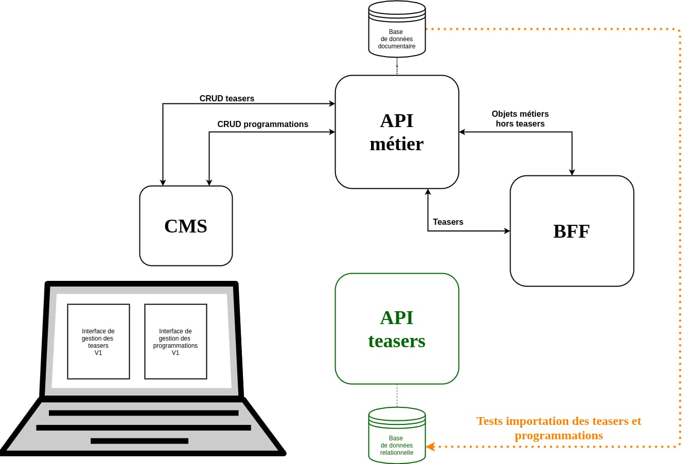
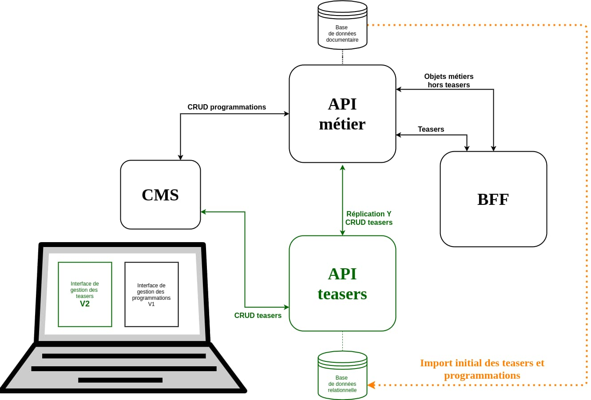
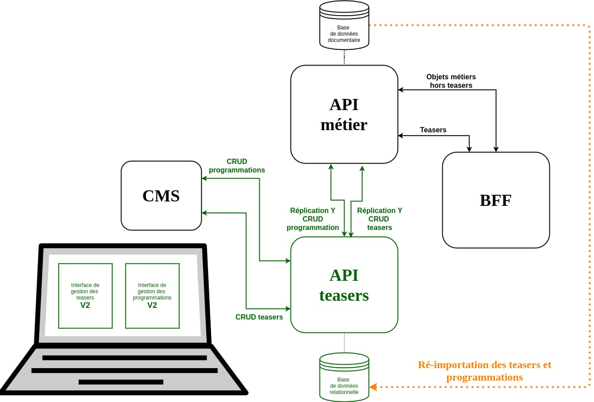
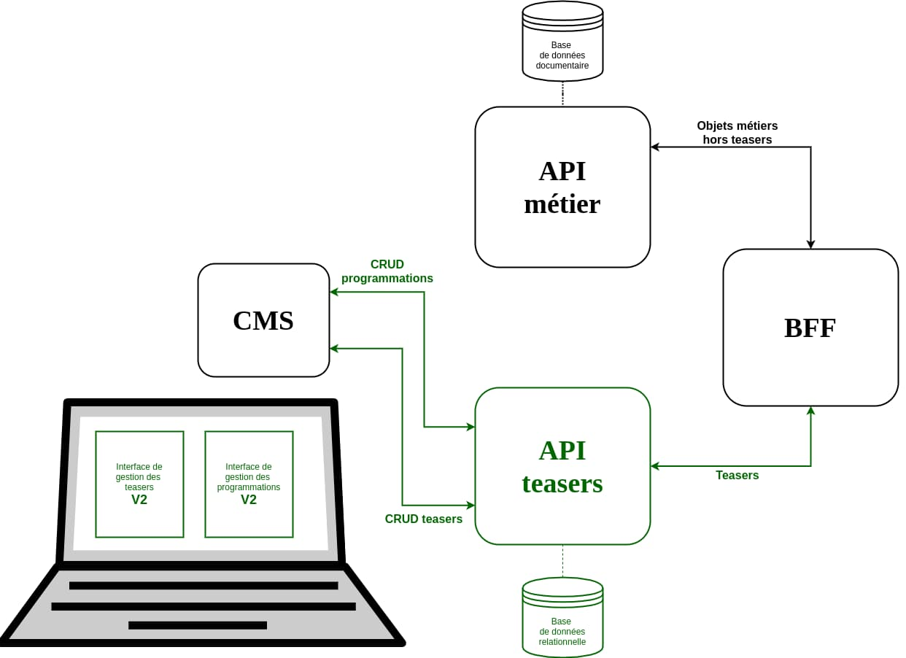
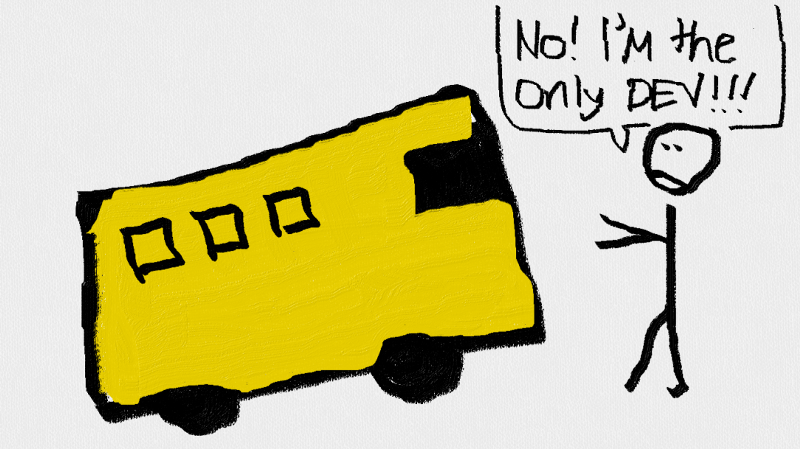

+++
layout: post
title: "Histoire d'une migration chez Arte, partie 3/3 : action"
excerpt: "Comment nous avons mis en œuvre une migration continue"
cover_image: "./images/migration-arte-3-action-cover.jpg"
thumbnail_image: "./images/migration-arte-3-action-thumb.jpg"
authors:
- alexis
tags:
- projet
- architecture
+++

[La première partie de cet article](/blog/2021/01/07/migration-continue-chez-arte-pourquoi.html) a montré pourquoi des impasses fonctionnelles nous ont poussés à migrer d’une API reposant sur une base documentaire vers une nouvelle API s’appuyant sur une base relationnelle.

[La seconde partie](/blog/2021/01/13/migration-continue-chez-arte-mise-en-place.html) a présenté les contraintes nous ayant amenés à choisir une migration continue plutôt qu’une simple bascule depuis l’ancien système vers le nouveau, ainsi que les outils mis en place pour mener ce chantier à bien.

Tout est maintenant prêt pour initier la migration. Action !

## Étape 0 : la phase de mise en place

Cette étape a été la plus longue, car elle correspond à toute la phase de mise en place décrite dans la seconde partie.

Le feature flag `migrationStep` avec une valeur de 0 indique au système de n’afficher que l’ancienne interface d’administration et de laisser la nouvelle API complètement isolée du reste de l’infrastructure.

Mais même avec cette valeur de feature flag à 0, l'intégralité du code impliqué dans la migration est déjà présent sur les différents services.

## Étape 1 : activation de la gestion des teasers

Cette étape 1 a démarré par l’importation des teasers depuis la production, puis à l’attribution de la valeur 1 au feature flag `migrationStep`. Cet état 1 provoque deux changements majeurs du point de vue du système :

1. L’ancienne interface d’édition des teasers est remplacée de manière transparente par la nouvelle interface branchée à la nouvelle API.
2. La nouvelle API réplique les opérations CRUD liées aux teasers sur l’ancienne API métier.

Ce n’était pas l’étape la plus risquée, les objets teasers étant relativement simples et possédant un vrai identifiant unique sur l’API métier. Les scripts de comparaison étaient aussi très fiables, puisqu’il est assez facile de comparer l’ensemble des teasers présent sur les deux systèmes puis de s'assurer que tous les nouveaux teasers sont bien présents sur les deux API.

Cette étape n’a duré que deux jours, sans nécessiter de retour en arrière. Nous n’avons eu à faire que quelques ajustements sur l’interface d’administration.

## Étape 2 : activation de la gestion des programmations

L’attribution de la valeur 2 au feature flag `migrationStep` provoque deux nouveaux changements :

1. La nouvelle interface d’administration remplace intégralement l’ancienne.
2. La nouvelle API réplique l’intégralité des opérations CRUD liées aux teasers et à leur programmation sur l’ancienne API métier.

Il s’agissait de l’étape que nous redoutions le plus, puisque nous savions que l’importation des anciennes programmations n’était pas complètement juste. D’ailleurs, cette étape a débuté par une réimportation complète de la base de l’API métier, puisque la nouvelle API n’avait jusqu’à présent pas pris en charge ces programmations.

Si nous avions abandonné l’idée d’avoir toutes les programmations depuis l’import, nous savions tout de même quelles étaient les principales différences entre les deux systèmes. Nous avons donc réalisé « à la main » un réajustement en supprimant les programmations non présentes sur le nouveau système de la base de données de l’API métier, puis en le recréant depuis la nouvelle interface. Cela a permis de corriger les principales erreurs.

Nous avons ensuite surveillé à intervalles réguliers l’état des programmations sur les deux systèmes pendant une semaine. Et rien ne nous a poussés à refaire une bascule en étape 1. Nous avons eu encore une fois à réaliser quelques ajustements sur l’interface d’administration, mais rien de bloquant.

Le seul évènement notable est arrivé au bout du troisième jour. Nous avions décidé de limiter les données importées depuis l’ancienne base. En effet, cela semblait inutile d’importer de vieux teasers non programmés, ainsi que les programmations périmées. Mais il se trouve que certains éditeurs avaient pris l’habitude d’utiliser ces vieux teasers comme modèle pour des programmations récurrentes. Or, notre script d’import n’avait pas importé ces vieux teasers d’exemple !

Nous avons donc dû changer les règles d'importation pour remonter plus loin dans le temps, et relancer un import complet de la base de données depuis l’ancienne API. Ce fut aussi l’occasion de confirmer l’efficacité de notre édition en Y : nous n’avons constaté aucune perte de données lors de ce réimport.

## Étape 3 : branchement de la nouvelle API sur le BFF

L’attribution de la valeur 3 au feature flag `migrationStep` ne provoque qu’un seul changement : le BFF fait appel à la nouvelle API pour récupérer les informations sur les teasers et leur programmation.

Cette étape était techniquement simple, mais constituait tout de même le baptême du feu de la production pour la nouvelle API.

À ce propos, même en considérant que le choix d’une migration continue nous permettrait d’adapter le système au cours du temps en cas de besoin, nous n’avons pas attendu de brancher la nouvelle API sur le BFF de production pour voir comment elle pourrait supporter la charge.

Non, pour cela nous avions utilisé sur le système de préproduction un outil qui gagne à être connu : [GoReplay](https://github.com/buger/goreplay).

En mettant le système de préproduction en étape 3 et ayant au préalable importé les données de production, GoReplay nous a permis de répliquer en direct tous les appels réalisés sur le BFF de production vers le BFF de préproduction. Ainsi, en surveillant les journaux système (les logs, via une stack [ELK](https://www.elastic.co/fr/what-is/elk-stack) et en surveillant les serveurs grâce à l'[APM](https://en.wikipedia.org/wiki/Application_performance_management) (Application Performance Management) d'Arte, nous avions validé que la nouvelle API et les requêtes sql faites à PostgreSQL supporteraient le trafic publique des applications d'Arte.

Si cette étape s’est déroulée sans problème, c’est aussi la seule étape ayant nécessité un retour en arrière vers l’étape précédente. Et ce toujours pour le problème d’historique des teasers. En effet, la précédente modification de nos règles d’import des teasers n’avait pas été suffisante. D’autres éditeurs nous ont remonté l’absence de vieux teasers non programmés, mais encore utiles. Nous avons donc pris la décision d’importer la totalité des teasers présents sur l’ancienne base, pour ne plus avoir de problème. Le problème était qu’en étape 3, la nouvelle API ne pouvait plus être temporairement indisponible, puisqu’elle servait le BFF de production. Nous sommes donc repassés en étape 2 le temps de relancer l’import complet des teasers. C’est aussi le seul moment où nous avons demandé aux éditeurs de ne pas utiliser l’interface d’édition.

## Étape 4 : suppression de l’édition en Y

Dernière valeur acceptée par le feature flag `migrationStep` : 4. Dans cette configuration, tout le code de migration en Y est désactivé. Le système se retrouve dans l’état final souhaité.

Cette phase sonnait la fin de notre chantier ! Nous pouvions alors enlever tout le code écrit pour la migration, un petit peu comme retirer l’échafaudage d’une maison lorsque sa construction se termine : supprimer l’édition en Y, retirer le feature flag des différents services, éteindre l’ancienne interface d’administration. Mais aussi permettre à l’ancienne API de s’alléger du code lié aux teasers.

Et ce démontage fut joyeux, la migration ayant été une réussite : nous n’avions perdu aucune programmation à la fin des deux semaines de transition, et n’avions interrompu ni le travail des éditeurs ni les applications Arte.

## La fin de l’histoire

C’est moi qui viens de vous raconter cette histoire. Mais je n’en ai été qu’un acteur. Cette histoire est celle d’une équipe : François, Lucas, Maxime, Olivier, Simon, Thiery, Virginie et moi.

Et c’est important, car au-delà des outils ou des patterns d’architecture abordés dans ce (long) article, c’est finalement le fonctionnement de cette équipe qui a été garante de la réussite du projet.

Je ne dis pas cela que dans une volonté de remercier tout le monde, mais parce qu’il me semble qu’il y a ici des choses à transmettre. Une méthode de travail qui nous est chère chez Marmelab.

### Une équipe agile

Chez Marmelab donc, [nous travaillons en sprint](https://marmelab.com/blog/2013/02/11/pour-la-fin-des-contrats-au-forfait.html). Nous nous faisons fort d’avoir une capacité à itérer rapidement, à délivrer rapidement des choses testées et testables, mais aussi à rapidement pivoter. C’est un peu notre marque de fabrique.

Pour autant, cette capacité à faire bien rapidement n’est pas le but, du moins je le crois, recherché par l’agilité. Cela peut en être une conséquence positive selon l’équipe et le projet. Mais l’agilité, c’est avant tout « *L’adaptation au changement plus que le suivi d’un plan* » et pas uniquement sur un temps de projet court.

S’agissant de notre coopération avec Arte, nous sommes plutôt fièrs d’avoir formé une équipe sachant faire preuve d’une agilité sereine.

Selon les périodes, nous pouvons passer d’une gestion plutôt [Kanban](https://fr.wikipedia.org/wiki/Kanban) à une gestion [Scrum](https://fr.wikipedia.org/wiki/Scrum_(d%C3%A9veloppement)). Nous pouvons fonctionner sur des sprints de deux semaines, ou de trois, voir sans sprint du tout. C’est en fonction des besoins, des projets. Dans le cadre de la migration décrite dans cet article, nous sommes effectivement passés en mode Scrum, tout d’abord sur des sprints de 3 semaines, puis de deux semaines quand nous sentions que le projet avait besoin de motivation ou de feedbacks.

Le chantier de migration s’est en fait étalé sur plus de 6 mois. Au cours de ces 6 mois, il a été au moins une fois mis en stand-by, un autre besoin s’étant imposé entre temps. Bref, nous savons adapter notre tempo au besoin. Un petit peu comme de passer d’un bœuf avec [Gary Peacock](https://www.youtube.com/watch?v=rlOPrO0Pj7M) à un jam avec [MonoNeon](https://www.youtube.com/watch?v=8LklqHcXxiU). Mais sans jamais perdre le fil du projet.

La seule chose qui est vraiment immuable : notre daily réunissant chaque matin toute l’équipe pendant un quart d’heure. Il pourrait ne durer que 3 minutes d’ailleurs puisqu’il ne se résume pas au contestable « *ce que j’ai fait hier, ce que je vais faire aujourd’hui* ». Il pourrait se limiter à un « Bon matin tout le monde 😀 » : quelque chose d’important serait déjà dit.

### Une équipe de taille raisonnable

Second point important : la taille de l’équipe. On pourrait se dire qu’avec un service de CMS, une API métier, une nouvelle API, un BFF, nous constituons une grosse équipe. Et bien non, nous sommes trois développeurs du côté Marmelab et 5 chefs de projet, du côté Arte.

Certes, nous ne sommes pas trois pour tout développer et maintenir, il y a une équipe dédiée sur l’API métier, des équipes dédiées pour les applications autres que web, et nous travaillons en collaboration avec une équipe « design system » sur l’application web. Mais sur le reste, nous sommes trois.

Pas parce que nous serions des [développeurs X10](https://www.jesuisundev.com/tu-nes-pas-un-developpeur-rockstar/), loin de là ! C’est que nous trouvons que c’est une bonne taille, nous permettant de tous avoir une bonne connaissance de l’ensemble des services. C’est cela qui nous permet de toujours faire les revues de code sur l’ensemble des projets ou de pouvoir passer d’un bug sur l’application web au développement d’une nouvelle fonctionnalité sur le CMS.

Peut-être à court terme cela nous rend moins rapides. Mais dès le moyen terme, on s’aperçoit que cela évite le [facteur d'autobus](https://fr.wikipedia.org/wiki/Facteur_d'autobus) ! Et cela a été important pour mener sur 6 mois un projet qui a traversé un confinement, des journées de hackdays et des vacances d’été ! Bref, on croit en cette idée que plus l’on sera nombreux, moins l’information circulera dans son intégralité.

Et d’ailleurs, cela ne s’applique pas qu’aux développeurs, mais à toute l’équipe : si les non-développeurs avaient au départ une étiquette « chef **du** projet », au quotidien tous sont en mesure de parler et de prendre des décisions sur les projets des autres. Mais aussi de lancer un déploiement depuis la CI, de créer une release sur Github, de commenter nos pull requests. Pour vous dire, les développeurs ont même le droit de créer des tickets sur Jira !

Je finirais par un dernier argument : à plus de huit, le daily ne peut plus tenir 15 minutes. Or, je l’ai déjà dit, le daily est immuable.

### Une équipe professionnelle

J'ai vu récemment ce tweet résumant assez bien ce troisième point :

<blockquote class="twitter-tweet">
    
I don’t ask if I can write tests. I don’t ask if I can spend time refactoring before I commit. I don’t ask if I can make the UI accessible. I don’t ask if I can make my code performant and secure. I don’t ask for permission to do my job well.
&mdash; Cory House (@housecor) <a href="https://twitter.com/housecor/status/1338119101026357251?ref_src=twsrc%5Etfw">December 13, 2020</a>
</blockquote>

Ce dont je peux témoigner sur ce projet, c’est que :

- sans avoir eu **un code lisible** (et les revues de code systématiquement réalisées par un collègue y jouent un grand rôle), nous aurions eu bien du mal à identifier les règles spécifiques d’interprétation des programmations,
- sans avoir eu **un code bien découplé**, nous aurions eu toutes les peines du monde à mettre en place le feature flag pilotant les différentes étapes de la migration,
- sans avoir eu **des tests** pertinents sur tous les services, nous aurions été beaucoup, beaucoup moins confiants sur notre capacité à activer chacune des phases de la migration.

## Épilogue

Cette migration est aujourd'hui derrière nous. Nous commençons à détricoter les verrous de la nouvelle interface pour pouvoir profiter au mieux du nouveau modèle et voir la quantité de teasers dupliqués diminuée.

L'équipe parle maintenant de donner un peu plus d'attention à l'application web arte.tv et à son [système de SSR déjà vieillissant](https://marmelab.com/blog/2017/10/17/code-splitting.html). Nul doute que cela fera une nouvelle histoire à raconter !
