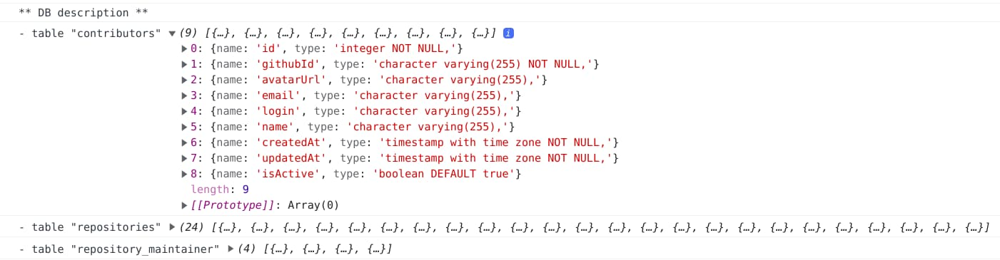

+++
title="Using An SQLite Database Live In React-Admin"
slug="using-an-sqlite-database-live-in-react-admin"
date = 2021-10-14
description="To use a database in a web app, we have to build an API. But what if we could use a database directly from the browser?"
draft = false
in_search_index = true
[taxonomies]
categories = ["informatique"]
tags = ["foss"]
[extra]
marmelab="https://marmelab.com/blog/2021/10/14/using-an-sqlite-database-live-in-react-admin.html"
+++

I've been looking for a way to easily share a database for a small project that doesn't warrant a "real" database server. Until now, I was thinking of trying a slightly innovative DBaaS, like [PlanetScale](https://planetscale.com/), [Prisma](https://www.prisma.io/), [Back4App](https://www.back4app.com/) or [OrbitDB](https://orbitdb.org/). But if the interest to test these services is still there, it didn't really answer my goal. It would only move the "real" server to a third party, which is not justified in terms of infrastructure (and therefore ecological impact) for my small project.

Of course, a small project means a small database that can be easily exported in JSON or CSV. But I discovered this excellent article by [phiresky](https://github.com/phiresky/), ["Hosting SQLite databases on Github Pages"](https://phiresky.github.io/blog/2021/hosting-sqlite-databases-on-github-pages/), which made me want to test this solution based on [a real database](https://antonz.org/sqlite-is-not-a-toy-database/) rather than on simple export files. And I'm going to do the test with [reac-admin](https://marmelab.com/react-admin/).

> Warning: The rest of this article assumes that we will query the database from a simple static server. We will therefore only be able to do **read operations**, which is what I actually need, but perhaps not for all readers of these lines.

## A Special SQLite Client For The Web

`sql.js-httpvfs` is the pet name of the open-source component built by [phiresky](https://github.com/phiresky/). It is an SQLite client for web browsers and a fork of [sql.js](https://github.com/sql-js/sql.js/). I won't go into why it's special, the [original blog post](https://phiresky.github.io/blog/2021/hosting-sqlite-databases-on-github-pages/) will do it better than I can, but as this component relies on [web workers](https://developer.mozilla.org/fr/docs/Web/API/Web_Workers_API/Using_web_workers) and [WebAssembly](https://webassembly.org/), it implies two things.

First, it makes it harder to bootstrap a react-admin application. That's because in an app created with `create-react-app`, you'll have to override the `webpack` configuration (in version 4) to handle the Wasm part of the component properly. And nobody likes to have to [overload a configuration on a `create-react-app`](https://marmelab.com/blog/2021/07/22/cra-webpack-no-eject.html). For my part, I started with [a React bootstrap repository](https://github.com/altafino/react-webpack-5-tailwind-2) including the `webpack` version 5 directly.

Second, the launch of the `web worker` allowing access to the SQLite client (essential to the *data provider* of react-admin) is asynchronous. This means it is necessary to wait for the end of the web worker initialization before instantiating our react-admin application.

That gives :

```jsx
// in src/App.js
import React, { useState, useEffect } from 'react'
import { Admin, Resource, Loading } from 'react-admin'
import { createDbWorker } from 'sql.js-httpvfs'

import dataProviderFactory from './dataProvider';

const workerUrl = new URL(
  'sql.js-httpvfs/dist/sqlite.worker.js',
  import.meta.url
)
const wasmUrl = new URL('sql.js-httpvfs/dist/sql-wasm.wasm', import.meta.url)
const config = {
  from: "inline",
  config: {
    serverMode: "full", // file is just a plain old full sqlite database
    requestChunkSize: 4096, // the page size of the  sqlite database (by default 4096)
    url: process.env.DB_URL // url to the database (relative or full)
  }
};

const App = () => {
  const [dataProvider, setDataProvider] = useState(null);

  useEffect(() => {
    const startDataProvider = async () => {
      const dbClient = await createDbWorker(
        [config],
        workerUrl.toString(), wasmUrl.toString()
      );
      setDataProvider(dataProviderFactory(dbClient));
    }
    if (dataProvider === null) {
      startDataProvider();
    }
  }, [dataProvider]);

  if (dataProvider === null) {
    return <Loading />
  }

  return <Admin dataProvider={dataProvider} />
}

export default App
```

## A Data Provider Requesting SQL

Ordinarily, a react-admin *data provider* fetches data via an API call. Here, the data provider must directly query the SQLite database (loaded in memory within the web worker). 

To make my job easier, I looked for a SQlite-compatible JavaScript [query builder](https://openbase.com/categories/js/best-maintained-javascript-sqlite-query-builder-libraries), namely [SQL Bricks.js](http://csnw.github.io/sql-bricks/) and its [SQlite extension](https://github.com/CSNW/sql-bricks-sqlite).

This is what it looks like:

```jsx
import queryBuilder from './sqlQueryBuilder'

const formatSqlResult = ({ columns, values }) => {
  return values.map((value) => {
    return value.reduce(
      (acc, data, index) => ({ ...acc, [columns[index]]: data }),
      {}
    )
  })
}

const getPaginatedListQuery = (resource, params) => {
  return queryBuilder
    .select()
    .from(resource)
    .where(params.filter)
    .limit(params.pagination.perPage)
    .offset((params.pagination.page - 1) * params.pagination.perPage)
    .orderBy(`${params.sort.field} ${params.sort.order}`)
    .toParams({ placeholder: '?%d' })
}

const getFilteredCountListQuery = (resource, params) => {
  return queryBuilder
    .select('COUNT(*)')
    .from(resource)
    .where(params.filter)
    .toParams({ placeholder: '?%d' })
}

const getTotalFromQueryCount = (result) => result[0].values[0][0]

export default (dbClient) => ({
  getList: (resource, params) => {
    const { text: countQuery, values: countParams } = getFilteredCountListQuery(
      resource,
      params
    );
    return dbClient.db
      .exec(countQuery, countParams)
      .then((countResult) => {
        const total = getTotalFromQueryCount(countResult);
        const { text: listQuery, values: listParams } = getPaginatedListQuery(
          resource,
          params
        )
        return total ? dbClient.db
          .exec(listQuery, listParams)
          .then((result) => {
            return {
              data: formatSqlResult(result[0]),
              total,
            }
          }) : {
            data: [],
            total,
          }
      })
      .catch((error) => {
        console.log('SQL error: ', error)
        return error
      })
  },

  // ...
})
```

## Introspection

The benefit of having a real relational database is that it is quite easy to get information about the tables, columns, and relationships. 

For example, in SQlite, you can obtain the list of tables with the query:

```sql
SELECT name FROM sqlite_master WHERE type='table' AND name NOT LIKE 'sqlite_%';
```

So, we can imagine a function able to return a complete description of the database, something like :

```jsx
export const getDbDescription = async dbClient => {
    const tableNames = await dbClient.db
        .exec("SELECT name FROM sqlite_master WHERE type='table' AND name NOT LIKE 'sqlite_%'")
        .then((result) => result[0].values.map(v => v[0]));
    
    const tableQueries = tableNames.map(name => {
        const { text, values } = queryBuilder
            .select('sql')
            .from('sqlite_master')
            .where({ name })
            .toParams({ placeholder: '?%d' });
        return dbClient.db
            .exec(text, values)
            .then((result) => getRessourceFromCreateQuery(result[0].values[0][0]));
    });
    
    const tablesDescriptions = await Promise.all(tableQueries);

    global.console.log('** DB description **');
    tablesDescriptions.forEach((table, index) => {
        global.console.log(`- table "${tableNames[index]}"`, table);
    });
}
```

When run in the console, this script results to:



I imagine that we could use this information to generate the appropriately configured react-admin `resources` on the fly, in the same way as the  `<AdminGuesser />` of [API Platform](https://github.com/api-platform/admin) does.

## Conclusion

I am fully convinced of the value of `sql.js-httpvfs` as a way of easily exposing the contents of a database for public viewing. `react-admin` is perhaps a little underused in the illustration I've just given, as all the data mutation part is set aside. However, it allows to generate filterable and paginable lists of the database content at a minimum cost or to take advantage of the export functions to make fairly precise extractions.

You can see for yourself the site (fully static hosting on Github, including the database of course) illustrating this article: [https://marmelab.com/ra-sqlite-dataprovider](https://marmelab.com/ra-sqlite-dataprovider).

If the solution is useful to you, why not make a [pull request on the repository](https://github.com/marmelab/ra-sqlite-dataprovider) pushing the introspection features further forward, to implement a `<AdminSQliteGuesser dbClient={dbClient} />` component capable of automatically generating all the interfaces of objects accessible from the database...
