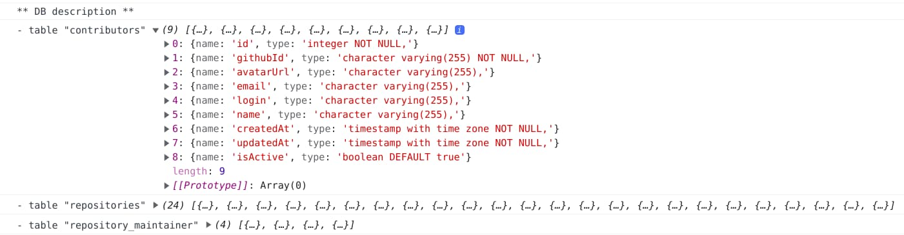

+++
title="Utiliser une base SQlite dans react-admin"
slug="utiliser-une-base-sqlite-dans-react-admin"
date = 2021-10-14
description="Nous sommes souvent amenés à mettre une API en face d'une base de données. Utilisons cette base de données directement depuis le navigateur, par exemple avec react-admin !"
draft = false
in_search_index = true
[taxonomies]
categories = ["informatique"]
tags = ["foss"]
+++

Cela fait un moment que le cherche un moyen de partager facilement une base de données pour un petit projet ne justifiant pas la mise en place d'un "vrai" serveur de base de données. Jusque là, j'envisageais de tester un DBaaS un peu innovant, du genre [PlanetScale](https://planetscale.com/), [Prisma](https://www.prisma.io/), [Back4App](https://www.back4app.com/) ou [OrbitDB](https://orbitdb.org/). Mais si l'envie de tester ces services est toujours là, cela ne répondait pas vraiment à mon objectif. Cela ne ferait que déplacer le "vrai" serveur vers un tiers, ce que ne justifiait pas en termes d'infrastructure (et donc d'impact ... écologique) mon petit projet.

Alors certes, qui dit petit projet dit petite base de données facilement exportable en json ou en csv. Mais je suis tombé sur cet excellent article de [phiresky](https://github.com/phiresky/), ["Hosting SQLite databases on Github Pages"](https://phiresky.github.io/blog/2021/hosting-sqlite-databases-on-github-pages/), qui m'a bien donné envie de tester cette solution à base [d'une vraie base de données](https://antonz.org/sqlite-is-not-a-toy-database/) plutôt que de partir sur de simples fichiers d'export. Et je vais faire le test avec [reac-admin](https://marmelab.com/react-admin/).

> Avertissement : si SQlite est une vraie base de données, la suite de cet article part du principe que l'on va requêter sur la base depuis un simple serveur statique. Nous ne pourrons donc faire **que des opérations de lecture**, ce qui correspond bien à mon besoin, mais peut-être pas à tous les lecteurs de ces lignes.

## Un client SQLite pour le web

`sql.js-httpvfs` c'est le petit nom du composant open source de [phiresky](https://github.com/phiresky/). Il s'agit en fait d'un fork de [sql.js](https://github.com/sql-js/sql.js/). Je ne rentrerais pas dans les détails, le post le blog original le fera mieux que moi, mais l'utilisation de ce composant s'appuyant sur des [web workers](https://developer.mozilla.org/fr/docs/Web/API/Web_Workers_API/Using_web_workers) et du [WebAssembly](https://webassembly.org/), cela implique deux choses.

Tout d'abord, il rend plus difficile le bootstrap d'une application react-admin. En effet, on se complique les choses en lançant un `create-react-app` car on est alors obligé de surcharger la configuration du `webpack` en version 4 afin de pouvoir gérer correctement la partie Wasm du composant. Et personne n'aime à avoir à surcharger une configuration sur une application `create-react-app`. Pour ma part, je suis partie sur [un dépôt de bootstrap React](https://github.com/altafino/react-webpack-5-tailwind-2) incluant directement le `webpack` 5.

Ensuite, le lancement du `web worker` permettant d'accéder au client SQlite indispensable au `data provider` de react-admin étant asynchrone, il faut attendre la fin démarrage de ce web worker avant d'instancier notre application react-admin.

Ce qui donne :

```javascript
// in src/App.js
import React, { useState, useEffect } from 'react'
import { Admin, Resource, Loading } from 'react-admin'
import { createDbWorker } from 'sql.js-httpvfs'

import dataProviderFactory from './dataProvider';

const workerUrl = new URL(
  'sql.js-httpvfs/dist/sqlite.worker.js',
  import.meta.url
)
const wasmUrl = new URL('sql.js-httpvfs/dist/sql-wasm.wasm', import.meta.url)
const config = {
  from: "inline",
  config: {
    serverMode: "full", // file is just a plain old full sqlite database
    requestChunkSize: 4096, // the page size of the  sqlite database (by default 4096)
    url: process.env.DB_URL // url to the database (relative or full)
  }
};

const App = () => {
  const [dataProvider, setDataProvider] = useState(null);

  useEffect(() => {
    const startDataProvider = async () => {
      const dbClient = await createDbWorker(
        [config],
        workerUrl.toString(), wasmUrl.toString()
      );
      setDataProvider(dataProviderFactory(dbClient));
    }
    if (dataProvider === null) {
      startDataProvider();
    }
  }, [dataProvider]);

  if (dataProvider === null) {
    return <Loading />
  }

  return <Admin dataProvider={dataProvider} />
}

export default App
```

## Un data provider requêtant du sql

Classiquement, un `data provider` react-admin va chercher les données via un appel à une API. Ici, il va en fait directement faire des requêtes à la base de données SQlite (chargée en mémoire via le web worker). 

Pour me faciliter le travail, j'ai cherché un [query builder](https://openbase.com/categories/js/best-maintained-javascript-sqlite-query-builder-libraries) JavaScript compatible SQlite, en l'occurence [SQL Bricks.js](http://csnw.github.io/sql-bricks/) et son [extention SQlite](https://github.com/CSNW/sql-bricks-sqlite).

Voila à quoi cela ressemble :

```javascript
import queryBuilder from './sqlQueryBuilder'

const formatSqlResult = ({ columns, values }) => {
  return values.map((value) => {
    return value.reduce(
      (acc, data, index) => ({ ...acc, [columns[index]]: data }),
      {}
    )
  })
}

const getPaginatedListQuery = (resource, params) => {
  return queryBuilder
    .select()
    .from(resource)
    .where(params.filter)
    .limit(params.pagination.perPage)
    .offset((params.pagination.page - 1) * params.pagination.perPage)
    .orderBy(`${params.sort.field} ${params.sort.order}`)
    .toParams({ placeholder: '?%d' })
}

const getFilteredCountListQuery = (resource, params) => {
  return queryBuilder
    .select('COUNT(*)')
    .from(resource)
    .where(params.filter)
    .toParams({ placeholder: '?%d' })
}

const getTotalFromQueryCount = (result) => result[0].values[0][0]

export default (dbClient) => ({
  getList: (resource, params) => {
    const { text: countQuery, values: countParams } = getFilteredCountListQuery(
      resource,
      params
    );
    return dbClient.db
      .exec(countQuery, countParams)
      .then((countResult) => {
        const total = getTotalFromQueryCount(countResult);
        const { text: listQuery, values: listParams } = getPaginatedListQuery(
          resource,
          params
        )
        return total ? dbClient.db
          .exec(listQuery, listParams)
          .then((result) => {
            return {
              data: formatSqlResult(result[0]),
              total,
            }
          }) : {
            data: [],
            total,
          }
      })
      .catch((error) => {
        console.log('SQL error: ', error)
        return error
      })
  },

  // ...
})
```

## Introspection

L'avantage avec une base de données, c'est qu'il est assez facile d'obtenir des informations sur les tables et les contenus de ces tables. 

Par exemple, en SQlite, on peut obtenir la liste des tables avec la requête

```sql
SELECT name FROM sqlite_master WHERE type='table' AND name NOT LIKE 'sqlite_%';
```

On peut donc imaginer une fonction capable de retourner une description complète de la base, quelque chose ressemblant à :

```javascript
export const getDbDescription = async dbClient => {
    const tableNames = await dbClient.db
        .exec("SELECT name FROM sqlite_master WHERE type='table' AND name NOT LIKE 'sqlite_%'")
        .then((result) => result[0].values.map(v => v[0]));
    
    const tableQueries = tableNames.map(name => {
        const { text, values } = queryBuilder
            .select('sql')
            .from('sqlite_master')
            .where({ name })
            .toParams({ placeholder: '?%d' });
        return dbClient.db
            .exec(text, values)
            .then((result) => getRessourceFromCreateQuery(result[0].values[0][0]));
    });
    
    const tablesDescriptions = await Promise.all(tableQueries);

    global.console.log('** DB description **');
    tablesDescriptions.forEach((table, index) => {
        global.console.log(`- table "${tableNames[index]}"`, table);
    });
}
```

Ce qui donne dans la console :



Rien n'empêche d'imaginer de mettre en place à partir de ces informations un mécanisme permettant de générer à la voler les `ressources` react-admin convenablement configurées, à l'image de ce que fait le composant `<AdminGuesser />` [d'API Platform](https://github.com/api-platform/admin).

## Conclusion

Pour ma part, je suis pleinement convaincu de l'intérêt `sql.js-httpvfs` pour pouvoir exposer facilement et publiquement le contenu d'une base de données à des fin de consultation. `react-admin` est peut-être un peu sous-exploité dans l'illustration que je viens d'en donner, car toutes la partie mutation des données n'est pas utilisable. N'en reste pas moins que cela permet de générer à moindre coût des listes filtrables et paginables du contenu de la base ou de profiter des fonctionnalités d'export pour y faire des extraction assez précises.

Vous pouvez pour vous en convaincre aller voir le site illustrant cet article : [https://marmelab.com/ra-sqlite-dataprovider](https://marmelab.com/ra-sqlite-dataprovider).

Et si la solution peut vous servir, pourquoi ne pas proposer une [pull request sur le dépôt](https://github.com/marmelab/ra-sqlite-dataprovider) poussant plus en amont les fonctionnalités d'introspection afin de mettre en place un composant `<AdminSQliteGuesser dbClient={dbClient} />` capable de générer automatiquement toutes les interfaces des objets accessibles depuis la base de données ...
