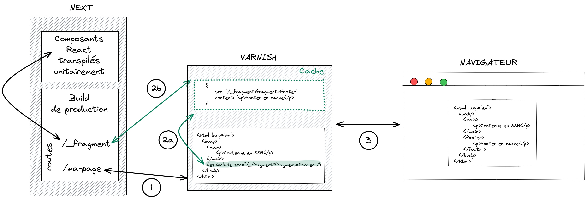

+++
title="Utiliser des balises ESI avec Next.js"
slug="utiliser-des-balises-esi-aves-next-js"
date = 2021-11-01
description="Comment améliorer encore plus le temps de réponse d'un site basé sur Next.js ? Avec des ESI !"
draft = false
in_search_index = true
[taxonomies]
categories = ["informatique"]
tags = ["web"]
+++

Récemment, nous avons migré un site React s'appuyant sur un système de SSR "maison" vers Next.js. Et nous ne regrettons pas ce choix tant l'expérience développeur est concluante, tout en apportant un gain de performance et en nous libérant des difficultés de monter de version de l'ancienne stack. Mais nous restions confrontés à un problème. 

Notre site s'appuie sur une API retournant tout le contenu d'une page en un seul appel, et le système de cache de page de Next est parfait pour optimiser ce simple appel puisque le cache se fait sur le rendu de toute la page. Mais nous un avons un second contenu à afficher s'appuyant sur un autre appel API : le pied de page du site. Ce *footer* est amené à changer car il est administrable, mais ce changement est beaucoup moins régulier que le contenu d'une page. Enfin ce pied de page n'est pas contextuel: c'est le même contenu, quelle que soit la page. 

La question est donc : comment éviter d'appeler la route d'API de ce footer à chaque génération de page ?

## Mise en cache de l'appel à l'API

La première solution évidente est de mettre en cache au niveau du serveur Next cet appel à la route d'API du footer.

C'est sans aucun doute une très bonne solution, maitrisée et éprouvée. Mais nous l'avons gardé comme seconde option, car lors de nos discussions sur ce problème, nous avions formulé ce souhait :

> *Idéalement, ça aurait été top que Next puisse rendre un composant spécifique avec un cache différent de celui de la page qui l'appelle. Un genre de ESI du SSR.*

Et justement, il existe un composant pour cela : [react-esi](https://github.com/dunglas/react-esi)

## Mise en place de react-esi

La documentation du projet est très claire, et la mise en place d'un footer compatible [ESI](https://fr.wikipedia.org/wiki/Edge_Side_Includes) ne pose pas de problèmes.

Considérons que notre site utilise un *layout* permettant d'inclure le footer sur toutes les pages.

```js
// in src/componants/Layout.js

import withESI from 'react-esi';
import Footer from './Footer';
import styles from '../styles/Home.module.css'

// The second parameter is an unique ID identifying this fragment.
const FooterESI = withESI(Footer, 'Footer');

const Layout = ({ children }) => {
	return (
		<div className={styles.container}>
			{children}
			<FooterESI repo="react-esi"/>
		</div>
	);
};

export default Layout;
```

```js
// in src/componants/Footer.js

class Footer extends React.Component {
	render() {
		return (
			<footer>
				The react-esi repository has <span>
				{this.props.data ? this.props.data.stargazers_count : '--'}
				</span> stars on Github.
			</footer>
		);
	}

	static async getInitialProps({ props, req, res }) {
		return fetch(`https://api.github.com/repos/dunglas/${props.repo}`)
			.then((fetchResponse) => {
				return fetchResponse.json();
			})
			.then(json => {
				if (res) {
					res.set('Cache-Control', 's-maxage=60, max-age=30');
				}
				return {
					...props,
					data: json,
				};
			})
	};
};

export default Footer;
```

C'est l'occasion de faire une première remarque : `reac-esi` n'utilise pas de hook, mais un *bon vieux* HOC et une classe React. Alors ce n'est sans doute pas à la mode, mais cela reste un chouette pattern, et pour les plus inquiets d'entre nous, rappelons ce que dit la [documentation de React](https://reactjs.org/docs/hooks-intro.html#gradual-adoption-strategy) :

> **TLDR: There are no plans to remove classes from React.**

La partie front est terminée. Mais comme nous le verrons dans la partie suivante de cet article, pour qu'un composant puisse être mis en cache ESI, il faut également mettre en place une route spécifique permettant le rendu de ce composant indépendamment du reste de la page.

D'ailleurs cela explique le `if (res)` de la classe `Footer` : dans le cas ou le composant est appelé unitairement (et comme il s'agira d'un appel spécifique, nous aurons une requête `req` et une réponse `res` ), nous allons pouvoir déclarer le temps de cache ce composant via le header http standard de cache `Cache-Control`.

Pour mettre en place cette nouvelle route, nous allons devoir mettre à jour la partie serveur de Next via un fichier `server.js` :

```javascript
// in src/server.js

const express = require('express');
const next = require('next');
const { path, serveFragment } = require('react-esi/lib/server');

const dev = process.env.NODE_ENV === 'development';

const app = next({ dev });
const handle = app.getRequestHandler();
const port = 3000;

app.prepare().then(() => {
    const server = express();
    server.get(path, (req, res) =>
        serveFragment(
			req,
			res,
			(fragmentID) => require(`./components/${fragmentID}`).default,
		),
    );

    server.all('*', (req, res) => {
        return handle(req, res);
    });

    server.listen(port, (err) => {
        if (err) throw err;
        console.log(`> Ready on http://localhost:${port}`);
    });
});
```

C'est donc le middleware `serveFragment` qui va prendre en charge cette nouvelle route `path`. Par défaut, cette route sera accessible en `/_fragment`, mais on peut la configurer via une variable d'environnement `REACT_ESI_PATH`.

**Attention, pour que ces modifications soient prises en compte, vous ne devez plus lancer l'application de développement avec un `next dev`, mais avec un `node src/server.js` !**

Il reste une dernière petite chose à faire : ajouter l'entête HTTP `Surrogate-Control` déclarant que notre réponse inclue des ESI. On peut ajouter cet entête dans le fichier `server.js` que nous venons de voir, ou bien les ajouter à la configuration de [Next](https://nextjs.org/docs/api-reference/next.config.js/headers) :

```javascript
module.exports = {
  async headers() {
    return [
      {
        source: '/',
        headers: [
          {
            key: 'Surrogate-Control',
            value: 'content="ESI/1.0"',
          },
        ],
      },
    ]
  },
}
```

## Le résultat en production

La première chose à faire pour avoir un environnement de production, c'est de *builder* notre application. Et c'est la que l'utilisation de `react-esi` nous fait un peu sortir des cloues du Next.js idiomatique. 

En effet, la phase de build de next implique une transpilation et une mise en bundle (via webpack) du code de l'application cliente. Or, pour que la route `/_fragment` fonctionne, le serveur va avoir besoin du code isolé (donc en dehors des chunks classiques de Next) et transpilé ! Nous devons donc ajouter une phase de transpilation Babel de notre code source.

```json
// in package.json
{
  "name": "react-esi",
  "version": "0.1.0",
  "private": true,
  "scripts": {
    "dev": "node src/server.js",
    "build": "next build",
    "postbuild": "babel src -d dist",
    "start": "node dist/server.js"
  }
}
```

**Attention bis, pour que les modifications du serveur Next soient prises en compte, vous ne devez plus lancer l'application de production avec un `next start`, mais avec un `node dist/server.js` !**

Il reste un dernier point à traiter avant de pouvoir tester la version de production : mettre en place un serveur de cache HTTP devant le serveur Next.js, par exemple un Varnish. La solution la plus simple sur un poste de développement est d'utiliser Docker et Docker Compose. Vous trouverez un exemple de configuration sur le dépôt Github d'illustration de cet article.

Et voici maintenant schématiquement le fonctionnement de notre implémentation de footer mis en cache :



(1) Le serveur Next ne va pas renvoyer le rendu du composant `Footer`, mais une balise ESI :
	
```html
<div>
	<esi:include src={'/_fragment?fragment=Footer&props={"repo":"react-esi"}&sign=9aa38503cb866bfb53f4c5ba1a7b136f19d25fde20d3d4ba13ebea1'} />
</div>
```

L'étude de cette balise ESI appelle deux remarques.

Tout d'abord, on constate que l'on appelle la route d'API en nommant le composant dont on attend le rendu `/_fragment?fragment=Footer` mais que l'on transmet aussi les *props* de ce composant `&props={"repo":"react-esi"}`. Et cela, c'est très pratique. Imaginons que notre footer soit internationalisé. Dans ce cas, nous aurions une propriété  `locale` permettant d'avoir un cache différent de notre footer par locale.

Ensuite on constate que l'appel à l'api de rendu des fragments ESI est inclu un token de signature`&sign=9aa38503cb866bfb53f4c5ba1a7b136f19d25fde20d3d4ba13ebea1` afin sécuriser cette route d'API.

(2a) Varnish regarde s’il a le fragment en cache. Si oui, il utilise ce cache pour remplacer la balise ESI.

(2b) Si Varnish n'a pas le fragment en cache, il appelle le serveur next sur la route déclarée dans le `src` de la balise. Cette route retourne le rendu HTML du composant identifier par le paramètre de requête `fragment` et ses propriétés `props`. Varnish met ce bout de HTML en cache, et l'utilise pour remplacer la balise ESI.

(3) Varnish renvoie la page HTML finale au client

```html
<div>
	<script>window.__REACT_ESI__ = window.__REACT_ESI__ || {}; window.__REACT_ESI__['Footer'] = {"repo":"react-esi","data":{"stargazers_count":572}};document.currentScript.remove();</script>
	<footer style="width:100%;height:100px;border-top:1px solid #eaeaea;text-align:center;padding-top:2rem">
		The react-esi repository has <span style="font-weight:bold;margin:O 5px">572</span> stars on Github.
	</footer>
</div>
```

## Varnish devient-il obligatoire en développement ?

Si Varnish n'est pas présent pour rendre la balise ESI, sommes-nous condamnés à développer les fragments à l'aveugle en l'absence de serveur de cache HTTP ?

Bien sûr que non. Si la balise ESI arrive jusqu'au navigateur, c'est le code JavaScript qui prend le relais pour rendre le code du composant. Dans le cas de l'exemple de cet article, l'appel à l'API de Github se fera donc depuis le navigateur.

Pour autant, il est assez simple de mettre en place un serveur Varnish dans un environnement de développement avec Docker. Et même si Varnish n'est pas utilisé pour le développement, il est tout de même très pratique et rassurant d'avoir un environnement permettant de tester l'environnement de production avant d'envoyer le code ... en production.

Vous trouverez des exemples de configuration de Docker Compose sur le [dépôt d'illustration de cet article](https://github.com/alexisjanvier/react-esi-demo). D'ailleurs, n'hésitez pas à utiliser ce dépôt pour essayer par vous-même la mise en place de fragments ESI.

## Conclusion

Force est de constater que l'utilisation d'ESI répond parfaitement à la problématique initiale. 

La solution consistant à mettre en cache côté API aurait sans doute aussi répondu au besoin. Et peut-être que lorsque les React Server Components sortiront de leur phase d'expérimentation, ils seront nativement supportés par Next.js et pourront offrir une réponse Next.js idiomatique pour cette fonctionnalité.

Mais d'ici là, l'utilisation des ESI est diablement efficace. Pour ne rien gâcher, j'aime beaucoup le fait qu'elle ne repose pas sur une nouvelle techo JavaScript, mais sur du bon vieux HTTP (la spécification 1.0 du langage ESI date de 2001, Varnish de 2006). On aurait presque l'impression de faire du *low web* :) Blague à part, j'ai parfois l'impression que certaines nouveautés du web s'acharnent à vouloir ré-inventer la roue, plutôt que d'exploiter au mieux ce qui existe. Mais Kevin Dunglas, l'auteur du composant react-esi, est l'une des personnes que je connaisse qui s'applique et excelle le mieux à utiliser tout cet existant tout en continuant à innover. Je vous conseille par exemple de regarder sa présentation de Vulcain. Et pour cela, un grand merci à lui.
